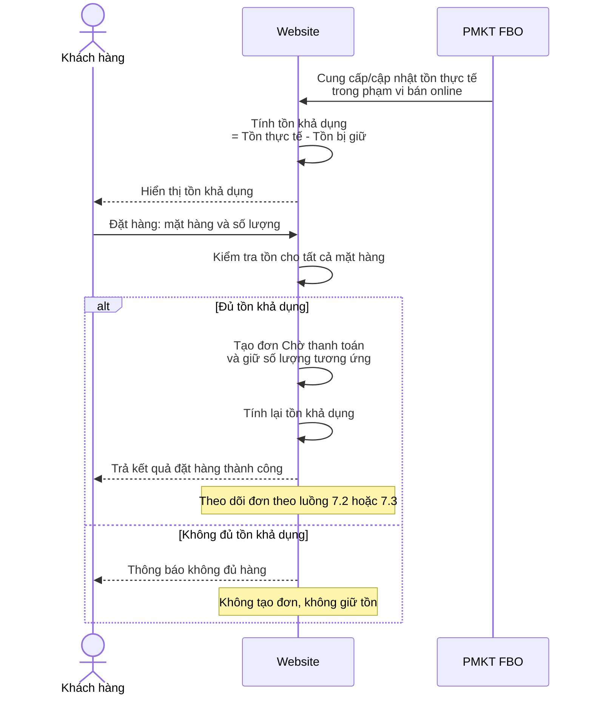
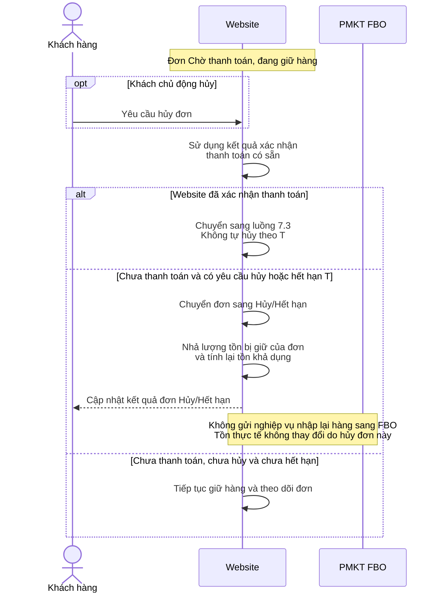
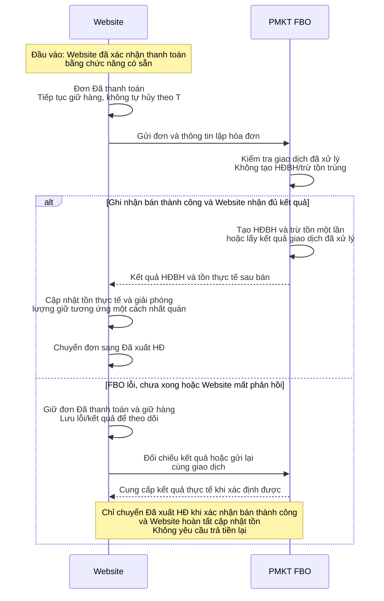
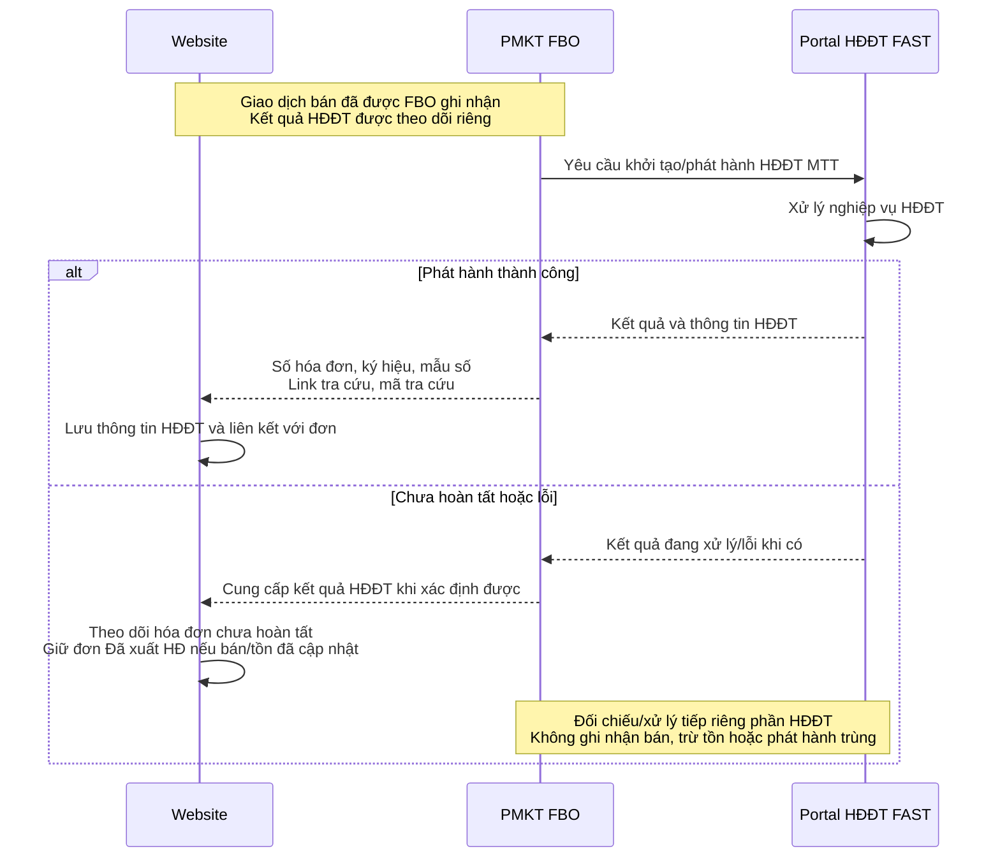
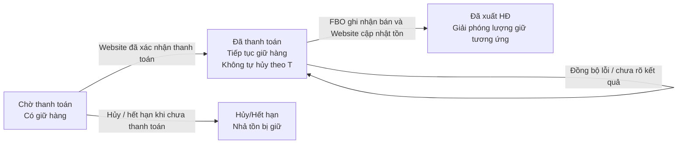
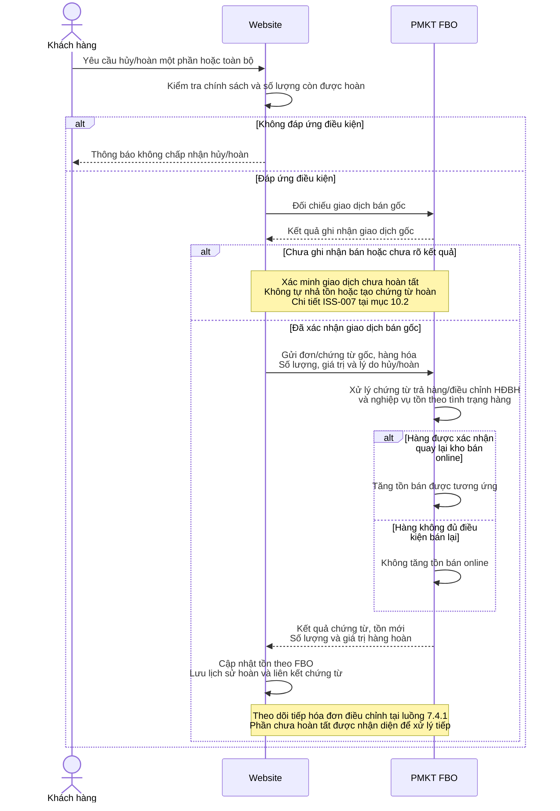
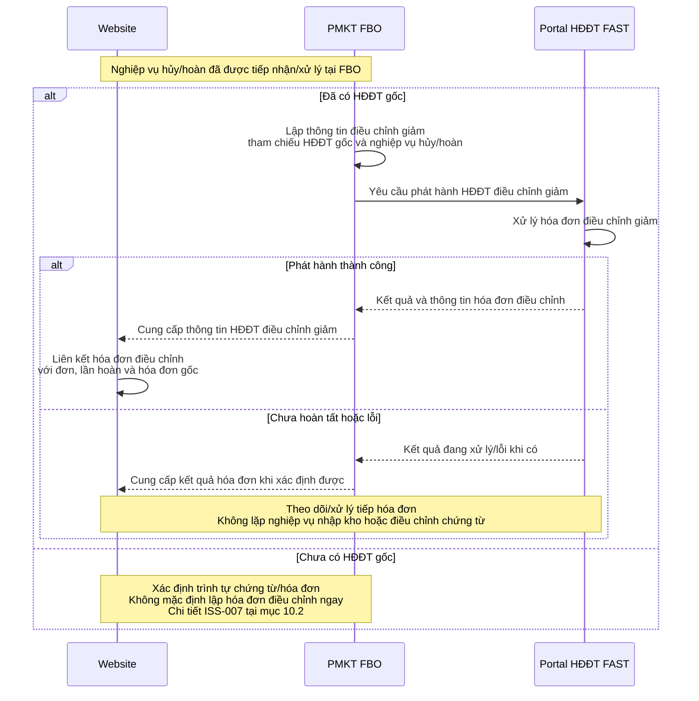

# BRD - Tích hợp Website Phương Thảo với FAST

## 1. Thông tin tài liệu

| Thuộc tính | Nội dung |
|---|---|
| Mã tài liệu | PT-BRD-001 |
| Phiên bản | 1.0 |
| Ngày cập nhật | 06/10/2026 |
| Trạng thái | Draft - Chưa phê duyệt |
| Phạm vi | Tồn kho, đơn hàng, đồng bộ đơn đã được Website xác nhận thanh toán, hủy/hoàn hàng và hóa đơn điện tử |
| Tài liệu tiếp nối | SRS (đặc tả chức năng và API), UAT Checklist, User Guide |

### 1.1. Nguồn yêu cầu

| Mã nguồn | Nguồn | Cách sử dụng |
|---|---|---|
| SRC-001 | Chị Thủy | Nhu cầu kinh doanh, quy hoạch tài liệu và quy ước truy vết |
| SRC-002 | Chị Thủy | Yêu cầu cập nhật về Chờ thanh toán, Đã thanh toán, giữ/nhả tồn và hủy/hoàn sau thanh toán |
| SRC-003 | Chị Thủy | Tài liệu giải pháp FAST hiện có; dùng để đối chiếu phạm vi và phát hiện khác biệt |

BRD này ghi nhận yêu cầu mới nhất của người yêu cầu. Những giải pháp do trợ lý đề xuất trong cuộc trao đổi được ghi là định hướng hoặc nội dung cần phân tích, không mặc định là yêu cầu đã được phê duyệt. Chi tiết API, kỹ thuật đồng bộ và thiết kế xử lý lỗi được phát triển trong SRS.

### 1.2. Quy ước đánh mã

Mã yêu cầu có dạng `<Module>-BR-<Số thứ tự>`; mã quy tắc nghiệp vụ có dạng `<Module>-BRU-<Số thứ tự>`. Module: `INV` (tồn kho), `ORD` (đơn hàng), `INVH` (hóa đơn), `INT` (tích hợp). Mã điểm cần phân tích có dạng `ISS-<Số thứ tự>`.

Mã được giữ ổn định khi thay đổi nội dung, không tái sử dụng mã đã hủy. SRS, test case và User Guide tham chiếu mã BRD để truy vết; quan hệ có thể là nhiều-nhiều. Các mã chức năng, API và test case được cấp khi có đặc tả tương ứng.

## 2. Bối cảnh và mục tiêu

Phương Thảo cần kết nối Website bán hàng với phần mềm FAST để khách hàng tự đặt hàng dựa trên tồn khả dụng, giữ hàng trong thời gian chờ thanh toán và ghi nhận giao dịch bán hàng tại FAST sau thanh toán. Hủy đơn, hoàn hàng và hóa đơn liên quan phải được quản lý xuyên suốt, bảo đảm tồn kho không bị cộng/trừ sai hoặc xử lý trùng.

Mục tiêu nghiệp vụ:

- Hiển thị số lượng hàng khách còn có thể đặt dựa trên tồn thực tế từ FAST và các đơn đang giữ hàng.
- Kiểm soát việc đặt hàng đồng thời để tránh bán vượt tồn khả dụng.
- Tự động giải phóng hàng khi đơn bị hủy hoặc quá thời hạn thanh toán.
- Đồng bộ đơn đã thanh toán sang FAST để tạo HĐBH, trừ tồn và khởi tạo/phát hành HĐĐT MTT.
- Quản lý hủy/hoàn sau thanh toán, một phần hoặc toàn bộ, gắn với tồn kho, chứng từ và hóa đơn điều chỉnh giảm.
- Cho phép theo dõi kết quả xử lý giữa Website và FAST.

## 3. Phạm vi và bên tham gia

| Bên/hệ thống | Vai trò nghiệp vụ |
|---|---|
| Khách hàng | Xem tồn khả dụng, đặt hàng, yêu cầu hủy/hoàn |
| Nhân sự Phương Thảo | Theo dõi đơn, xử lý hủy/hoàn theo chính sách và kiểm tra kết quả đồng bộ |
| Website Phương Thảo | Quản lý đơn, tồn bị giữ, tồn khả dụng; sử dụng kết quả xác nhận thanh toán do Website đã xử lý để trao đổi dữ liệu với PMKT FBO |
| PMKT FBO | Quản lý tồn thực tế; xử lý HĐBH, xuất/nhập kho và nghiệp vụ hóa đơn |
| Portal HĐĐT FAST | Thực hiện nghiệp vụ HĐĐT MTT và hóa đơn điều chỉnh giảm theo liên kết với FBO |

Trong tài liệu, PMKT chỉ hệ thống FAST tham gia tích hợp. Website không phải nguồn quản lý tồn thực tế. Phạm vi kho cấp hàng cho Website cần được xác định trong SRS; không mặc định mọi hàng ở mọi kho đều có thể bán online.

Việc xác nhận đơn đã thanh toán hay chưa do Website tự xử lý bằng chức năng đã có. Kết quả này là đầu vào cho nghiệp vụ quản lý tồn và đồng bộ đơn sang FBO. Dự án sử dụng kết quả xác nhận có sẵn; xây dựng hoặc thay đổi cơ chế thanh toán, xác thực giao dịch tiền và thực hiện hoàn tiền nằm ngoài phạm vi BRD/SRS này.

Phạm vi bao gồm:
- Đồng bộ tồn thực tế
- Tính tồn khả dụng
- Giữ hàng khi đặt đơn
- Thời hạn thanh toán
- Xử lý đơn đã thanh toán
- Hủy trước thanh toán
- Hủy/hoàn sau thanh toán 
- Thông tin hóa đơn

## 4. Khái niệm nghiệp vụ

| Khái niệm | Định nghĩa | Hệ thống chịu trách nhiệm |
|---|---|---|
| Tồn thực tế | Số lượng tồn do FAST quản lý và cung cấp, trong phạm vi kho cấp hàng cho Website | FBO |
| Tồn bị giữ | Tổng số lượng hàng trên các đơn Chờ thanh toán và Đã thanh toán, tính theo từng mặt hàng và phạm vi kho tương ứng | Website |
| Tồn khả dụng | Tồn thực tế nhận từ FAST trừ tồn bị giữ | Website |
| Chờ thanh toán | Đơn đã được tạo và đang giữ hàng trong thời hạn cho phép | Website |
| Đã thanh toán | Website đã xác nhận khách trả tiền, nhưng chưa xác nhận hoàn tất ghi nhận bán và cập nhật tồn từ FBO; đơn tiếp tục giữ hàng | Website |
| Đã xuất HĐ | Website đã xác nhận khách trả tiền, FBO đã tạo HĐBH và trừ tồn thành công; Website đã cập nhật tồn và giải phóng lượng giữ tương ứng. | Website |
| HĐBH | Hóa đơn bán hàng/chứng từ bán hàng tại FAST | FBO |
| HĐĐT MTT | Hóa đơn điện tử khởi tạo từ máy tính tiền | FBO và Portal HĐĐT |
| Hủy trước thanh toán | Kết thúc đơn chưa thanh toán và giải phóng tồn bị giữ | Website |
| Hủy/hoàn sau thanh toán | Xử lý đảo/điều chỉnh giao dịch đã bán theo số lượng yêu cầu hủy/hoàn | Website phối hợp FBO |

Kết quả xác nhận thanh toán có sẵn của Website được sử dụng độc lập với kết quả xử lý tại FBO. Khi Website đã xác nhận đơn đang Chờ thanh toán được thanh toán thành công, đơn chuyển sang Đã thanh toán để bắt đầu đồng bộ FBO. Đơn giữ nguyên lượng hàng đang giữ, không còn chịu thời hạn thanh toán T và không được tự động hủy/nhả tồn vì FBO chậm xử lý hoặc đồng bộ thất bại.

Chỉ chuyển sang Đã xuất HĐ khi FBO xác nhận tạo HĐBH và trừ tồn thành công, đồng thời Website hoàn tất cập nhật tồn và giải phóng lượng giữ tương ứng. Việc FBO mới nhận yêu cầu chưa đủ để coi đồng bộ thành công. Kết quả phát hành HĐĐT được theo dõi riêng; lỗi hóa đơn không làm đơn quay lại Chờ thanh toán hoặc giữ lại lượng hàng đã ghi nhận bán.

## 5. Danh mục yêu cầu kinh doanh

| Mã | Yêu cầu và kết quả mong muốn | Trách nhiệm chính | Nguồn / cơ sở |
|---|---|---|---|
| INV-BR-001 | Website nhận tồn thực tế từ FAST để làm cơ sở bán hàng; các thay đổi tồn thuộc phạm vi bán online phải được cập nhật về Website | FAST cung cấp; Website tiếp nhận | SRC-001, SRC-002 / yêu cầu |
| INV-BR-002 | Website tính và hiển thị tồn khả dụng; cập nhật ngay khi tồn thực tế nhận được hoặc tồn bị giữ thay đổi | Website | SRC-002 / yêu cầu |
| ORD-BR-001 | Khách tự đặt đơn trên Website; chỉ tạo đơn và giữ hàng khi đủ tồn khả dụng, kể cả khi nhiều khách đặt đồng thời | Website | SRC-002 / yêu cầu và phân tích bổ sung |
| ORD-BR-002 | Đơn Chờ thanh toán giữ hàng tối đa trong thời hạn quy định; chưa thanh toán khi hết hạn thì tự động hủy và nhả tồn | Website | SRC-002 / yêu cầu |
| ORD-BR-003 | Khi Website đã xác nhận đơn được thanh toán bằng chức năng có sẵn, Website gửi đơn sang FAST; FAST tạo HĐBH, trừ tồn thực tế và trả tồn mới để Website cập nhật đơn, giải phóng phần tồn bị giữ tương ứng | Website và FAST | SRC-002 / yêu cầu |
| INVH-BR-001 | FAST khởi tạo/phát hành HĐĐT MTT cho giao dịch bán và trả thông tin hóa đơn về Website | FAST và Portal HĐĐT | SRC-002 / yêu cầu |
| ORD-BR-004 | Đơn Chờ thanh toán bị hủy trước thanh toán được nhả tồn trên Website; không phát sinh nghiệp vụ đảo tồn thực tế tại FAST | Website | SRC-001, SRC-002 / yêu cầu và định hướng |
| ORD-BR-005 | Hỗ trợ yêu cầu hủy/hoàn sau thanh toán, một phần hoặc toàn bộ, theo cùng cơ chế xử lý dựa trên số lượng | Website tiếp nhận; FAST xử lý giao dịch | SRC-002 / yêu cầu |
| INV-BR-003 | Website cập nhật tồn sau hoàn theo kết quả FAST; hàng không đủ điều kiện bán không được cộng vào tồn khả dụng để bán tiếp | FAST xác nhận; Website cập nhật | SRC-002 / định hướng nghiệp vụ |
| INVH-BR-002 | Khi xử lý hoàn giao dịch đã có HĐĐT gốc, PMKT lập HĐĐT điều chỉnh giảm tham chiếu hóa đơn gốc và trả thông tin về Website | FAST và Portal HĐĐT | SRC-002 / yêu cầu |
| ORD-BR-006 | Ghi nhận số lượng, giá trị hàng đã hoàn và kết quả xử lý chứng từ từ FBO; giữ lịch sử đơn gốc để theo dõi hoàn một phần hoặc nhiều lần | Website phối hợp FBO | SRC-002 / định hướng nghiệp vụ; phạm vi cập nhật 06/10/2026 |
| INT-BR-001 | Một giao dịch bán hoặc hủy/hoàn không được tạo chứng từ, thay đổi tồn hay phát hành hóa đơn trùng khi gửi lại yêu cầu | Website và FAST | SRC-002 / phân tích bổ sung |
| INT-BR-002 | Theo dõi được kết quả xử lý đơn, tồn và hóa đơn; giao dịch chưa hoàn tất cần được nhận diện để xử lý tiếp | Website và FAST | SRC-002 / phân tích bổ sung |
| ORD-BR-007 | Phân biệt đơn đã trả tiền nhưng chờ đồng bộ FBO với đơn đã trả tiền và đồng bộ thành công; bảo vệ hàng, ghi nhận lỗi và cho phép xử lý tiếp mà không yêu cầu khách thanh toán lại | Website phối hợp FBO | SRC-001 / yêu cầu cập nhật 06/10/2026 |

## 6. Quy tắc nghiệp vụ

| Mã | Quy tắc | Yêu cầu liên quan |
|---|---|---|
| INV-BRU-001 | Tồn khả dụng = Tồn thực tế từ FAST - Tồn bị giữ; các đại lượng phải cùng mặt hàng, đơn vị tính và phạm vi kho | INV-BR-001, INV-BR-002 |
| INV-BRU-002 | Tồn bị giữ = tổng số lượng mặt hàng trên các đơn Chờ thanh toán + tổng số lượng mặt hàng trên các đơn Đã thanh toán | INV-BR-002, ORD-BR-001, ORD-BR-007 |
| ORD-BRU-001 | Chỉ chấp nhận đặt hàng khi tồn khả dụng đủ cho từng mặt hàng của đơn; các đơn đồng thời không được cùng sử dụng vượt lượng khả dụng | ORD-BR-001 |
| ORD-BRU-002 | Đơn Chờ thanh toán giữ hàng tối đa T phút; giá trị T chưa được chốt. Quá hạn chưa thanh toán thì tự động hủy và giải phóng tồn | ORD-BR-002 |
| ORD-BRU-003 | Hủy trước thanh toán chỉ làm giảm tồn bị giữ; tồn thực tế không thay đổi do thao tác hủy này | ORD-BR-004 |
| INV-BRU-003 | Khi FAST ghi nhận bán Q sản phẩm và Website giải phóng Q sản phẩm đang giữ, tồn thực tế và tồn bị giữ cùng giảm Q. Tồn khả dụng không đổi nếu không có biến động khác | ORD-BR-003, INV-BR-002 |
| INV-BRU-004 | Website không tự điều chỉnh tồn thực tế theo trạng thái đơn; tồn thực tế được cập nhật từ kết quả FAST | INV-BR-001, INV-BR-003 |
| ORD-BRU-004 | Tổng số lượng hoàn thành công của mỗi dòng hàng không vượt số lượng đã bán; phải kiểm soát cả yêu cầu hoàn đang xử lý để tránh nhận vượt số lượng còn được hoàn | ORD-BR-005, ORD-BR-006 |
| INV-BRU-005 | Hoàn tiền không mặc định làm tăng tồn bán được. Chỉ hàng được FAST xác nhận quay lại phạm vi kho bán online mới làm tăng tồn thực tế dùng cho Website | INV-BR-003 |
| INVH-BRU-001 | Hóa đơn điều chỉnh giảm phải liên kết với hóa đơn gốc và nghiệp vụ hủy/hoàn tương ứng | INVH-BR-002 |
| INT-BRU-001 | Gửi lại cùng giao dịch không được làm thay đổi tồn, tạo chứng từ hoặc hóa đơn thêm lần nữa | INT-BR-001 |
| ORD-BRU-005 | Giữ lịch sử giao dịch gốc, các lần hoàn và kết quả xử lý chứng từ từ FBO; hoàn một phần không được làm mất thông tin phần hàng còn lại | ORD-BR-006 |
| ORD-BRU-006 | Khi xác nhận thanh toán thành công, chuyển đơn Chờ thanh toán sang Đã thanh toán; không giảm tồn bị giữ và không áp dụng tự hủy theo thời hạn thanh toán T | ORD-BR-002, ORD-BR-007 |
| ORD-BRU-007 | Chỉ chuyển đơn sang Đã xuất HĐ sau khi xác nhận FBO tạo HĐBH, trừ tồn thành công và Website hoàn tất cập nhật tồn, giải phóng lượng giữ tương ứng | ORD-BR-003, ORD-BR-007 |
| INT-BRU-002 | Khi đồng bộ lỗi, mất phản hồi hoặc chưa rõ kết quả, đơn vẫn Đã thanh toán; lưu kết quả/lỗi, tiếp tục kiểm tra hoặc gửi lại cùng giao dịch và cho phép nhân sự xử lý. Không yêu cầu trả tiền lại hoặc tự nhả tồn | ORD-BR-007, INT-BR-001, INT-BR-002 |
| INVH-BRU-002 | Theo dõi kết quả HĐĐT độc lập với đồng bộ HĐBH/tồn. Nếu ghi nhận bán và cập nhật tồn đã hoàn tất nhưng HĐĐT lỗi, giữ trạng thái Đã xuất HĐ và xử lý tiếp riêng phần hóa đơn | INVH-BR-001, ORD-BR-007, INT-BR-001 |

## 7. Luồng nghiệp vụ và định hướng giải pháp

Các sơ đồ dưới đây chia làn theo bên/hệ thống tham gia. Mũi tên giữa hai làn biểu thị trao đổi dữ liệu; mũi tên trong cùng một làn biểu thị nghiệp vụ hệ thống tự xử lý. Các nhánh điều kiện thể hiện tình huống thành công, từ chối hoặc cần xử lý tiếp.

### 7.1. Xem tồn và đặt hàng

Liên quan: `INV-BR-001`, `INV-BR-002`, `ORD-BR-001`.

Việc kiểm tra tồn, tạo đơn và giữ hàng phải bảo đảm các đơn đặt đồng thời không sử dụng vượt tồn khả dụng.

FAST tiếp tục cung cấp thay đổi tồn ngoài luồng đơn Website, như bán tại cửa hàng hoặc điều chỉnh kho. Cơ chế và thời gian đồng bộ được đặc tả trong SRS.

### 7.2. Hết hạn hoặc hủy trước thanh toán

Liên quan: `ORD-BR-002`, `ORD-BR-004`.

### 7.3. Thanh toán thành công và ghi nhận bán hàng

Liên quan: `ORD-BR-003`, `ORD-BR-007`, `INVH-BR-001`, `INT-BR-001`, `INT-BR-002`.

Sơ đồ tách kết quả bán hàng và kết quả HĐĐT để dễ theo dõi; FBO có thể khởi tạo HĐĐT cùng lúc xử lý bán hàng. Trạng thái Đã xuất HĐ tại đây xác nhận HĐBH/tồn đã được cập nhật, không mặc định HĐĐT đã phát hành thành công.

#### 7.3.1. Khởi tạo/phát hành HĐĐT MTT

Thông tin HĐĐT cần có: số hóa đơn, ký hiệu, mẫu số, link tra cứu và mã tra cứu. Đây là nhu cầu dữ liệu nghiệp vụ; tên trường, định dạng và cách trả kết quả được quy định trong SRS/API.

Nếu FBO lỗi, chưa xử lý xong hoặc Website không nhận được phản hồi, đơn giữ trạng thái Đã thanh toán. Website hiển thị kết quả thanh toán đã thành công và kết quả đồng bộ đang chờ/lỗi để nhân sự theo dõi; lưu thông tin lỗi, tiếp tục kiểm tra kết quả hoặc gửi lại cùng giao dịch. Mất phản hồi không được coi là FBO chưa thực hiện nghiệp vụ. Việc xử lý tiếp phải tuân thủ `INT-BRU-001` để tránh tạo HĐBH hoặc trừ tồn trùng.

Nếu không thể hoàn tất đồng bộ và cần kết thúc đơn đã trả tiền, phải xử lý theo nghiệp vụ hủy/hoàn sau thanh toán, xác minh kết quả tại FBO để xử lý chứng từ và tồn phù hợp; không dùng thao tác hủy trước thanh toán để nhả tồn trực tiếp. Xem [ISS-007 - Hủy/hoàn khi giao dịch bán hoặc hóa đơn chưa hoàn tất](#iss-007). Việc hoàn tiền được xử lý ngoài phạm vi tích hợp này.

#### 7.3.2. Chuyển trạng thái và tác động tồn

| Trạng thái/sự kiện | Thanh toán | Đồng bộ bán hàng FBO | Tồn bị giữ | Tự hủy theo T |
|---|---|---|---|---|
| Chờ thanh toán | Chưa xác nhận thành công | Chưa gửi bán hàng | Có | Có, nếu chưa thanh toán |
| Đã thanh toán | Đã thành công | Chưa gửi / đang xử lý / lỗi / chưa rõ kết quả | Tiếp tục giữ | Không |
| Đã xuất HĐ | Đã thành công | HĐBH, trừ tồn và cập nhật Website đã hoàn tất | Giải phóng lượng tương ứng | Không |
| Hủy/Hết hạn trước thanh toán | Chưa thanh toán | Không phát sinh bán hàng | Giải phóng | Đã kết thúc |

Thanh toán thành công chỉ chuyển loại đơn đang giữ, không làm thay đổi lượng giữ. Khi đồng bộ thành công, lượng giữ được chuyển thành lượng đã bán; tồn thực tế và tồn bị giữ cùng giảm số lượng tương ứng. Nếu một bản cập nhật tồn đã phản ánh giao dịch bán, hệ thống phải đối chiếu phần giữ tương ứng để không trừ cùng lượng hàng hai lần. Xem [ISS-004 - Cập nhật nhất quán tồn thực tế và tồn bị giữ](#iss-004).

### 7.4. Hủy/hoàn sau thanh toán

Liên quan: `ORD-BR-005`, `ORD-BR-006`, `INV-BR-003`, `INVH-BR-002`.

Với hàng đã giao, việc tăng tồn bán được phụ thuộc kết quả nhận và kiểm tra hàng; với hàng chưa giao, FBO xử lý đảo giao dịch theo tình trạng thực tế. Việc thực hiện hoàn tiền thuộc quy trình ngoài phạm vi dự án này.

Hoàn một phần và toàn bộ dùng chung cơ chế, khác số lượng yêu cầu. Mỗi lần hoàn được theo dõi riêng và liên kết với đơn gốc. Trường hợp chưa có HĐĐT gốc, thứ tự xử lý chứng từ/hóa đơn cần được phân tích; không mặc định có thể lập hóa đơn điều chỉnh ngay.

#### 7.4.1. HĐĐT điều chỉnh giảm cho giao dịch hủy/hoàn

### 7.5. Ví dụ biến động tồn

Ví dụ một mặt hàng, cùng phạm vi kho, không có biến động từ kênh khác:

| Sự kiện | Tồn thực tế | Tồn bị giữ | Tồn khả dụng |
|---|---:|---:|---:|
| Ban đầu | 10 | 0 | 10 |
| Khách đặt 3, đơn Chờ thanh toán | 10 | 3 | 7 |
| Nhánh A: đơn bị hủy trước thanh toán | 10 | 0 | 10 |
| Nhánh B: đã trả tiền, Chờ đồng bộ FBO; FBO chưa ghi nhận bán | 10 | 3 | 7 |
| Nhánh B: đồng bộ lỗi trước khi FBO ghi nhận bán | 10 | 3 | 7 |
| Nhánh B: thanh toán, FAST ghi nhận bán 3 và Website hoàn tất cập nhật | 7 | 0 | 7 |
| Sau nhánh B: hoàn 2, FAST xác nhận nhập lại kho bán | 9 | 0 | 9 |

Nhánh A và B là hai tình huống thay thế nhau. Các dòng chờ/lỗi minh họa khi FBO chưa trừ tồn; nếu FBO đã xử lý nhưng mất phản hồi, cần đối chiếu kết quả thực tế, không mặc định tồn vẫn là 10. Nếu hàng hoàn không đủ điều kiện bán lại thì việc hoàn tiền không làm tăng tồn khả dụng của Website.

## 8. Phân chia trách nhiệm

| Nghiệp vụ | Website | FAST / Portal |
|---|---|---|
| Quản lý và cung cấp tồn thực tế | Nhận, lưu dữ liệu đồng bộ | Quản lý, cung cấp |
| Tính/hiển thị tồn khả dụng | Chủ trì | Cung cấp tồn thực tế |
| Tạo đơn, kiểm tra và giữ hàng | Chủ trì | Không giữ hàng theo luồng mục tiêu |
| Hết hạn/hủy trước thanh toán | Hủy đơn, nhả tồn dựa trên kết quả xác nhận thanh toán có sẵn | Không đảo tồn thực tế |
| Sử dụng kết quả xác nhận thanh toán | Lấy kết quả từ chức năng Website đã có để bắt đầu đồng bộ đơn | Nhận đơn đã được Website xác nhận thanh toán |
| Đơn đã trả tiền, chờ đồng bộ | Phân biệt trạng thái, tiếp tục giữ hàng, theo dõi lỗi và xử lý tiếp | Cung cấp kết quả ghi nhận bán để đối chiếu, tránh xử lý trùng |
| HĐBH và trừ tồn | Gửi đơn, nhận kết quả | Chủ trì |
| HĐĐT MTT | Nhận và liên kết thông tin | Khởi tạo/phát hành, cung cấp kết quả |
| Tiếp nhận hủy/hoàn sau thanh toán | Chủ trì tiếp nhận | Xử lý nghiệp vụ liên quan |
| Điều chỉnh chứng từ, nhập lại/đảo tồn | Nhận kết quả, cập nhật tồn | Chủ trì theo tình trạng hàng |
| HĐĐT điều chỉnh giảm | Nhận và liên kết thông tin | Chủ trì |
| Theo dõi lỗi và xử lý lại | Theo dõi kết quả đồng bộ Website - FBO | Cung cấp kết quả xử lý FAST |

## 9. Tiêu chí nghiệm thu nghiệp vụ

| Mã | Tiêu chí | Tham chiếu |
|---|---|---|
| AC-001 | Website tính đúng tồn khả dụng theo tồn FAST và lượng giữ của cả đơn Chờ thanh toán lẫn Đã thanh toán; thay đổi tồn nhận từ FAST được phản ánh theo mức thời gian thống nhất trong SRS | INV-BR-001, INV-BR-002, ORD-BR-007 |
| AC-002 | Khi nhiều khách đồng thời đặt lượng hàng cuối cùng, tổng lượng được chấp nhận không vượt tồn khả dụng | ORD-BR-001 |
| AC-003 | Đơn chưa thanh toán hết hạn T hoặc bị hủy được nhả tồn; thao tác này không thay đổi tồn thực tế tại FAST | ORD-BR-002, ORD-BR-004 |
| AC-004 | Một đơn thanh toán thành công được ghi nhận bán một lần tại FAST; tồn thực tế và tồn giữ giảm cùng số lượng, không làm thay đổi tồn khả dụng nếu không có biến động khác | ORD-BR-003, INT-BR-001 |
| AC-005 | Website nhận và liên kết đủ thông tin HĐĐT MTT với đơn; nhận diện được hóa đơn chưa phát hành thành công | INVH-BR-001, INT-BR-002 |
| AC-006 | Hủy/hoàn một phần, toàn bộ và nhiều lần được theo dõi theo số lượng; không xử lý vượt lượng đã bán; giữ lịch sử đơn gốc | ORD-BR-005, ORD-BR-006 |
| AC-007 | Hàng hoàn đủ điều kiện bán chỉ làm tăng tồn khả dụng sau xác nhận FAST; hàng lỗi không được cộng vào tồn bán online chỉ vì đã hoàn tiền | INV-BR-003 |
| AC-008 | Giao dịch hoàn có hóa đơn gốc được liên kết với HĐĐT điều chỉnh giảm và kết quả xử lý số lượng, giá trị hàng hoàn từ FBO | INVH-BR-002, ORD-BR-006 |
| AC-009 | Gửi lại cùng giao dịch bán/hoàn sau lỗi hoặc mất phản hồi không tạo thêm chứng từ, hóa đơn hay thay đổi tồn lần nữa | INT-BR-001 |
| AC-010 | Khi thanh toán thành công nhưng FBO chưa xử lý/lỗi/mất phản hồi, đơn là Đã thanh toán, vẫn giữ hàng và không tự hủy khi vượt T; khách không bị yêu cầu thanh toán lại | ORD-BR-007, ORD-BR-002 |
| AC-011 | Sau đối chiếu hoặc gửi lại thành công, Website chuyển đơn sang Đã xuất HĐ và giải phóng lượng giữ đúng một lần cùng cập nhật tồn; có thể theo dõi lỗi và kết quả xử lý tiếp | ORD-BR-007, INT-BR-001, INT-BR-002 |
| AC-012 | FBO đã ghi nhận bán và Website cập nhật tồn thành công nhưng HĐĐT lỗi: đơn vẫn Đã xuất HĐ, không giữ lại hàng hoặc ghi nhận bán lại; phần hóa đơn được theo dõi và xử lý tiếp riêng | ORD-BR-007, INVH-BR-001 |

Kiểm thử luồng đơn đã thanh toán sử dụng kết quả xác nhận có sẵn của Website làm đầu vào; việc xác thực giao dịch tiền và thực hiện hoàn tiền không thuộc nghiệm thu dự án này.

Các tiêu chí trên là đầu vào cho UAT; test case chi tiết và dữ liệu kiểm thử sẽ được xây dựng theo SRS.

## 10. Các tình huống cần đặc tả tiếp

Mã ISS dùng để theo dõi nội dung cần phân tích/đặc tả tiếp, không phải mã chức năng hoặc một quy trình đã được phê duyệt đầy đủ. Phần này định nghĩa các mã được tham chiếu trong luồng nghiệp vụ mục 7.

### 10.1. ISS-004 - Cập nhật nhất quán tồn thực tế và tồn bị giữ

**Liên quan:** `INV-BR-002`, `ORD-BR-003`, `ORD-BR-007`, `INV-BRU-003`.

**Tình huống:** FBO đã trừ tồn cho một đơn, nhưng Website nhận dữ liệu tồn mới và kết quả đồng bộ đơn ở các thời điểm khác nhau. Nếu tồn thực tế đã giảm mà Website vẫn trừ toàn bộ lượng giữ của đơn, cùng lượng hàng sẽ bị tính giảm hai lần. Ngược lại, nhả lượng giữ trước khi cập nhật tồn thực tế có thể làm tăng tồn khả dụng sai.

**Nguyên tắc nghiệp vụ:** Website phải đối chiếu kết quả ghi nhận bán với lượng hàng đang giữ của đơn. Khi chuyển đơn sang Đã xuất HĐ, cập nhật tồn thực tế và giải phóng lượng giữ tương ứng phải bảo đảm nhất quán; gửi lại hoặc nhận lại cùng kết quả không được làm giảm/giải phóng tồn thêm lần nữa.

### 10.2. ISS-007 - Hủy/hoàn khi giao dịch bán hoặc hóa đơn chưa hoàn tất

**Liên quan:** `ORD-BR-005`, `ORD-BR-007`, `INVH-BR-002`, `INT-BR-001`.

**Tình huống:** Website đã xác nhận thanh toán, khách yêu cầu hủy/hoàn, nhưng chưa biết chắc FBO đã ghi nhận bán hay chưa; hoặc FBO đã ghi nhận bán nhưng HĐĐT gốc chưa phát hành thành công.

| Kết quả xác minh | Nguyên tắc xử lý |
|---|---|
| Chưa rõ FBO đã tạo HĐBH/trừ tồn hay chưa | Website phối hợp FBO đối chiếu giao dịch gốc. Không tự nhả tồn, tạo chứng từ trả hàng hoặc gửi lại yêu cầu bán như một giao dịch mới |
| Xác nhận FBO chưa ghi nhận bán | Cần xác định cách dừng yêu cầu đồng bộ đang chờ/đang xử lý và xác nhận giao dịch không thể tiếp tục ghi nhận bán trước khi kết thúc đơn, giải phóng lượng giữ. Không tạo nghiệp vụ nhập lại hàng cho giao dịch chưa xuất kho |
| FBO đã ghi nhận bán và đã có HĐĐT gốc | Xử lý hủy/hoàn theo mục 7.4, xử lý tồn theo tình trạng hàng và lập HĐĐT điều chỉnh giảm theo mục 7.4.1 |
| FBO đã ghi nhận bán nhưng HĐĐT gốc chưa hoàn tất | Theo dõi riêng kết quả bán hàng và hóa đơn. Không mặc định có thể lập HĐĐT điều chỉnh giảm khi chưa có hóa đơn gốc; phải xác định trình tự xử lý với FBO/Portal trước khi thực hiện |
