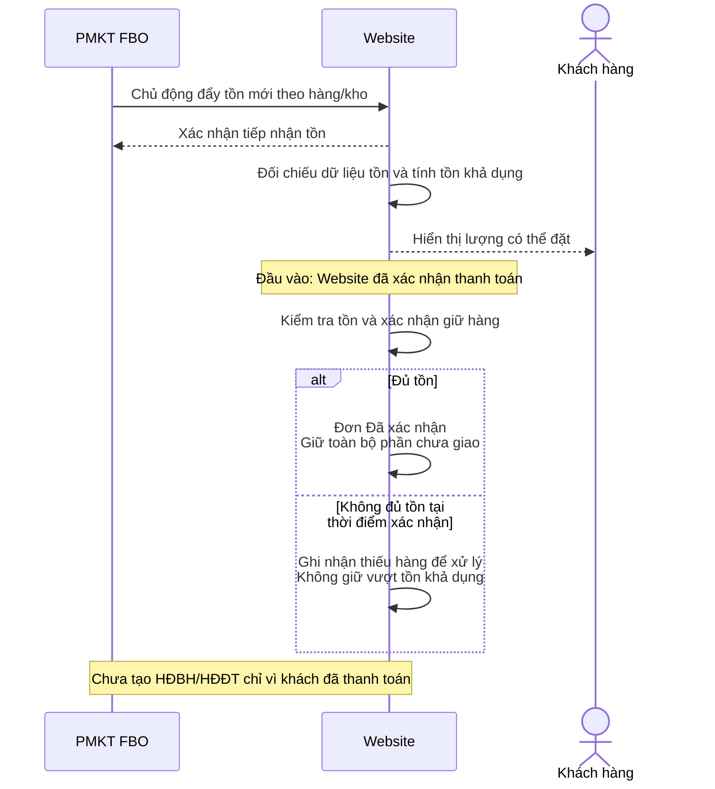
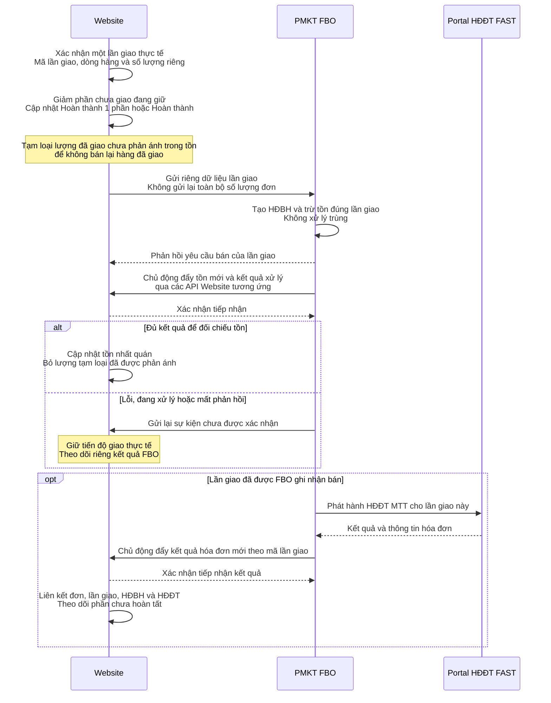
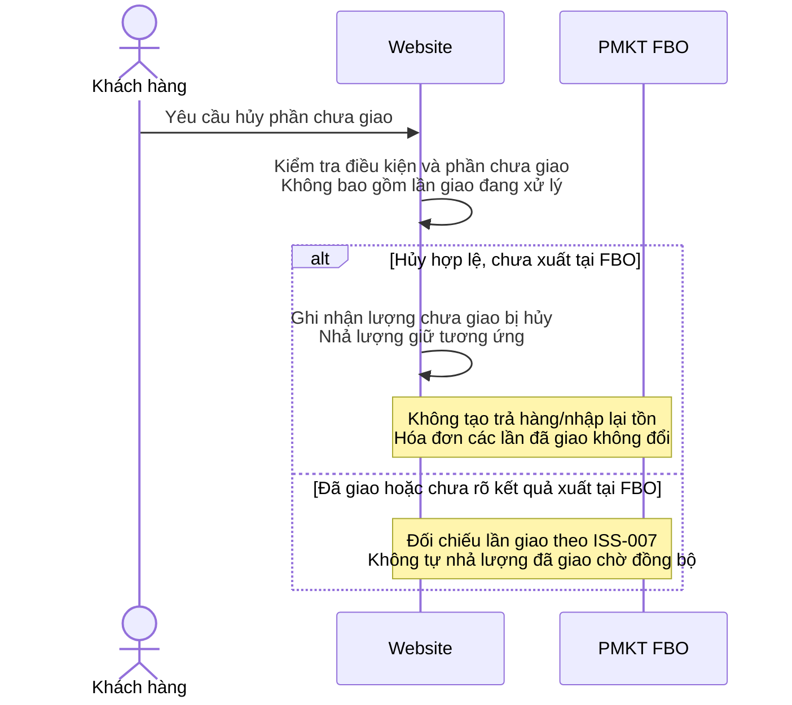
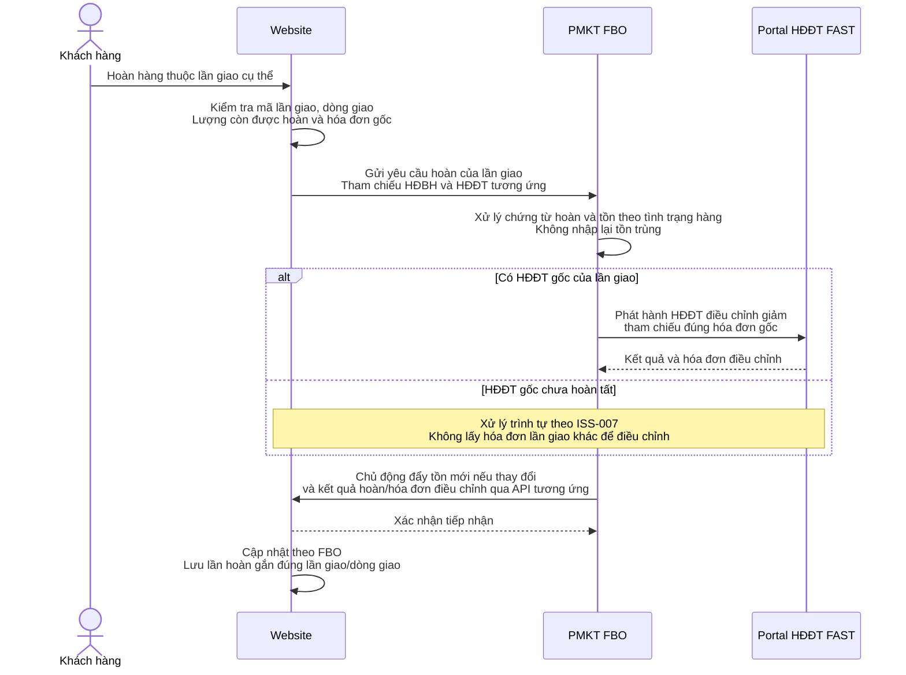

# BRD - Tích hợp Website Phương Thảo với FAST

## 1. Thông tin tài liệu

| Thuộc tính | Nội dung |
|---|---|
| Mã tài liệu | PT-BRD-001 |
| Phiên bản | 1.2 |
| Ngày cập nhật | 08/10/2026 |
| Trạng thái | Bản cập nhật theo yêu cầu mới, chờ chốt thay đổi |
| Phạm vi | Tồn kho, giữ phần chưa giao, giao hàng nhiều lần, HĐBH/HĐĐT theo lần giao và hoàn hàng theo lần giao |
| Tài liệu tiếp nối | SRS (đặc tả chức năng và API), UAT Checklist, User Guide |

### 1.1. Nguồn yêu cầu

| Mã nguồn | Nguồn | Cách sử dụng |
|---|---|---|
| SRC-001 | Chị Thủy | Nhu cầu kinh doanh, quy hoạch tài liệu và quy ước truy vết |
| SRC-002 | Chị Thủy | Các trao đổi nghiệp vụ tồn kho, đơn hàng và hủy/hoàn |
| SRC-003 | Chị Thủy | Tài liệu giải pháp FAST hiện có, dùng đối chiếu phạm vi/khả năng đáp ứng |
| SRC-004 | Yêu cầu cập nhật trong chat ngày 08/10/2026 | Trạng thái theo giao hàng, giữ phần chưa giao, hóa đơn theo từng lần giao và hoàn đúng lần giao |
| SRC-005 | Yêu cầu cập nhật trong chat ngày 08/10/2026 | FBO chủ động đẩy tồn kho, kết quả HĐĐT MTT và hóa đơn điều chỉnh khi có thông tin mới |

Phiên bản 1.1 thay thế mô hình ghi nhận bán ngay khi thanh toán của phiên bản 1.0. Xác nhận đã thanh toán chỉ làm đơn đủ điều kiện giữ/giao hàng; từng lần giao mới là mốc gửi FBO để ghi nhận bán, trừ tồn và phát hành HĐĐT MTT. Chi tiết kỹ thuật được phát triển trong SRS.

### 1.2. Quy ước đánh mã

Mã yêu cầu: `<Module>-BR-<Số thứ tự>`. Mã quy tắc: `<Module>-BRU-<Số thứ tự>`. Module: `INV` (tồn kho), `ORD` (đơn hàng), `INVH` (hóa đơn), `INT` (tích hợp). Mã nội dung cần đặc tả tiếp: `ISS-<Số thứ tự>`.

Mã giữ ổn định qua các phiên bản; yêu cầu/quy tắc bị thay thế được ghi rõ và không tái sử dụng cho nội dung khác. SRS, chức năng/API, test case và User Guide tham chiếu mã BRD để truy vết.

## 2. Bối cảnh và mục tiêu

Website Phương Thảo sử dụng tồn thực tế từ FBO để bán hàng. Đơn đã được Website xác nhận thanh toán có thể giao một lần hoặc nhiều lần. Website giữ phần hàng chưa giao; mỗi lần giao tạo giao dịch bán và HĐĐT riêng tại FBO/Portal. Khi hoàn hàng, cần xác định đúng lần giao và hóa đơn gốc để xử lý tồn, chứng từ và hóa đơn điều chỉnh tương ứng.

- Quản lý tồn khả dụng, không bán lại phần hàng đã dành cho đơn xác nhận.
- Giữ toàn bộ hàng chưa giao của đơn Đã xác nhận và phần chưa giao của đơn Hoàn thành 1 phần.
- Hỗ trợ nhiều lần giao trên một đơn; mỗi lần có danh sách hàng, số lượng và giá trị riêng.
- Tạo HĐBH và phát hành HĐĐT MTT cho từng lần giao, không xuất lại toàn bộ đơn mỗi lần giao.
- Hoàn hàng đúng lần giao, đúng dòng giao, đúng hóa đơn gốc; giữ lịch sử giao/hoàn.
- Theo dõi lỗi và xử lý lại từng lần giao/hoàn mà không ghi nhận trùng.

## 3. Phạm vi và bên tham gia

| Bên/hệ thống | Vai trò |
|---|---|
| Khách hàng | Đặt hàng, nhận hàng một hoặc nhiều lần, yêu cầu hủy/hoàn |
| Nhân sự Phương Thảo | Xác nhận và theo dõi giao hàng, hủy phần chưa giao, tiếp nhận/kiểm tra hoàn hàng |
| Website | Quản lý đơn, trạng thái giao, từng lần giao/hoàn, tồn bị giữ và tồn khả dụng; gọi FBO yêu cầu bán/hoàn; cung cấp API nhận tồn và kết quả do FBO chủ động gửi |
| PMKT FBO | Quản lý tồn thực tế; tạo HĐBH/trừ tồn cho từng lần giao; xử lý chứng từ hoàn và nhập lại tồn phù hợp; chủ động gửi tồn và kết quả HĐĐT mới cho Website |
| Portal HĐĐT FAST | Phát hành HĐĐT MTT và HĐĐT điều chỉnh liên kết với FBO |

Website đã tự xử lý xác nhận thanh toán. Xây dựng/thay đổi cơ chế thanh toán và thực hiện hoàn tiền nằm ngoài phạm vi. Trạng thái trước Đã xác nhận do Website hiện có quản lý; không giữ hàng cho các trạng thái trước xác nhận trong mô hình này. Không có yêu cầu giữ hàng theo Chờ thanh toán hoặc tự nhả hàng theo thời hạn thanh toán T ở phiên bản 1.1.

Phạm vi kho bán online, ánh xạ mã hàng/biến thể và đơn vị tính được xác định trong SRS. Nhập lại hàng không đủ điều kiện bán không làm tăng tồn cấp cho Website.

## 4. Khái niệm và trạng thái

| Khái niệm/trạng thái | Ý nghĩa |
|---|---|
| Đã xác nhận | Khách đã thanh toán, chưa giao hàng; giữ toàn bộ số lượng còn cần giao |
| Hoàn thành 1 phần | Đã giao một phần, còn hàng cần giao; giữ phần chưa giao |
| Hoàn thành | Đã giao toàn bộ số lượng cần giao; không còn lượng giữ do chưa giao |
| Lần giao | Một giao dịch giao hàng có mã riêng, thuộc một đơn; có dòng hàng, số lượng, ngày, kho và giá trị riêng |
| Dòng giao | Một dòng của lần giao, tham chiếu dòng đơn gốc; cùng dòng đơn có thể xuất hiện ở nhiều lần giao |
| Lần hoàn | Một yêu cầu hoàn có mã riêng, trỏ đến một lần giao và các dòng giao tương ứng |
| Tồn thực tế | Tồn do FBO cung cấp trong phạm vi kho cấp hàng cho Website |
| Tồn bị giữ | Tổng lượng chưa giao của các đơn Đã xác nhận và Hoàn thành 1 phần |
| Lượng đã giao chưa phản ánh trong tồn FBO nhận được | Lượng đã giao thực tế nhưng chưa được đối chiếu là đã trừ trong dữ liệu tồn Website đang sử dụng; cần tạm loại khỏi lượng có thể bán |
| Kết quả đồng bộ lần giao | Kết quả HĐBH, trừ tồn và HĐĐT của từng lần giao, độc lập với trạng thái giao hàng của đơn |

Luồng trạng thái: `Đã xác nhận → Hoàn thành 1 phần → Hoàn thành`. Nếu giao hết trong một lần, chuyển trực tiếp `Đã xác nhận → Hoàn thành`. Giao thêm nhưng chưa hết thì vẫn Hoàn thành 1 phần.

Trạng thái đơn phản ánh giao thực tế, không chờ FBO hoặc HĐĐT thành công mới ghi nhận đã giao. Lỗi tích hợp được theo dõi tại lần giao; không dùng Đã thanh toán/Đã xuất HĐ làm trạng thái thay thế cho tiến độ giao trong mô hình này.

## 5. Danh mục yêu cầu kinh doanh

| Mã | Yêu cầu cập nhật | Trách nhiệm |
|---|---|---|
| INV-BR-001 | FBO chủ động gọi API Website cập nhật tồn thực tế khi có thay đổi, kể cả thay đổi ngoài đơn Website | FBO và Website |
| INV-BR-002 | Website tính và hiển thị tồn khả dụng theo tồn FBO, phần chưa giao đang giữ và lượng giao chưa phản ánh trong tồn | Website |
| ORD-BR-001 | Kiểm tra đủ tồn khi chấp nhận xác nhận/giữ hàng; không giữ vượt lượng khả dụng khi nhiều đơn đồng thời được xác nhận | Website |
| ORD-BR-002 | Ngừng áp dụng: giữ Chờ thanh toán và tự hủy theo T của phiên bản 1.0 được thay thế bởi giữ phần chưa giao theo SRC-004 | Website |
| ORD-BR-003 | Mỗi lần giao gửi riêng FBO để tạo HĐBH, trừ tồn và khởi tạo HĐĐT cho đúng lượng/giá trị lần giao | Website và FBO |
| INVH-BR-001 | Mỗi lần giao có HĐĐT MTT riêng, liên kết mã đơn, mã lần giao và HĐBH tương ứng | FBO/Portal và Website |
| ORD-BR-004 | Hủy hợp lệ phần chưa giao thì nhả lượng giữ của phần đó; không tạo trả hàng/nhập lại tồn cho lượng chưa giao, chưa xuất tại FBO | Website |
| ORD-BR-005 | Hoàn một phần/toàn bộ phải chỉ rõ lần giao, dòng giao và số lượng hoàn | Website và FBO |
| INV-BR-003 | Chỉ tăng tồn bán online theo kết quả FBO khi hàng hoàn đủ điều kiện nhập lại kho bán | FBO và Website |
| INVH-BR-002 | HĐĐT điều chỉnh giảm tham chiếu đúng HĐĐT gốc của lần giao bị hoàn | FBO/Portal |
| ORD-BR-006 | Giữ lịch sử đơn, các lần giao, các lần hoàn, số lượng/giá trị và liên kết chứng từ/hóa đơn | Website và FBO |
| INT-BR-001 | Không xử lý trùng cùng lần giao hoặc cùng lần hoàn khi gửi lại | Website và FBO |
| INT-BR-002 | Theo dõi riêng kết quả bán/tồn/HĐĐT của từng lần giao và kết quả từng lần hoàn | Website và FBO |
| ORD-BR-007 | Phân biệt tiến độ giao thực tế với kết quả FBO; bảo vệ lượng đã giao chưa phản ánh trong tồn và xử lý tiếp phần đồng bộ lỗi | Website và FBO |
| ORD-BR-008 | Một đơn có nhiều lần giao; kiểm soát số lượng từng dòng giao không vượt phần còn cần giao | Website |
| INT-BR-003 | FBO chủ động gửi kết quả bán/HĐĐT MTT theo lần giao và kết quả hoàn/HĐĐT điều chỉnh khi có thông tin mới; bảo đảm gửi lại khi Website chưa xác nhận tiếp nhận | FBO và Website |

Các yêu cầu hiện hành đã cập nhật theo SRC-004; ORD-BR-002 giữ lại mã để truy vết nội dung đã ngừng áp dụng.

## 6. Quy tắc nghiệp vụ

| Mã | Quy tắc |
|---|---|
| INV-BRU-001 | Tồn khả dụng = Tồn thực tế FBO đang sử dụng - Tồn bị giữ - Lượng đã giao chưa phản ánh trong tồn đó; tính cùng mặt hàng, kho và đơn vị tính |
| INV-BRU-002 | Tồn bị giữ chỉ gồm lượng chưa giao của đơn Đã xác nhận và Hoàn thành 1 phần |
| ORD-BRU-001 | Kiểm tra tồn và giữ hàng khi xác nhận phải bảo đảm các đơn đồng thời không sử dụng vượt lượng khả dụng |
| ORD-BRU-002 | Ngừng áp dụng quy tắc giữ Chờ thanh toán tối đa T của phiên bản 1.0 |
| ORD-BRU-003 | Hủy phần chưa giao hợp lệ làm giảm lượng giữ, không tự cộng tồn thực tế FBO |
| INV-BRU-003 | Khi giao Q: lượng chưa giao đang giữ giảm Q. Nếu tồn FBO chưa phản ánh lần giao, lượng cần tạm loại khỏi khả dụng tăng Q. Khi tồn đã phản ánh và được đối chiếu, bỏ lượng tạm loại Q cùng cập nhật tồn; không tính giảm hai lần |
| INV-BRU-004 | Website không tự cộng/trừ tồn thực tế theo trạng thái đơn; tồn thực tế lấy từ FBO |
| ORD-BRU-004 | Lượng hoàn đề nghị mới + tổng lượng hoàn thành công trước đó + lượng hoàn đang xử lý của từng dòng giao không vượt lượng đã giao của dòng đó; không chỉ kiểm tra tổng lượng toàn đơn |
| INV-BRU-005 | Hoàn tiền hoặc yêu cầu hoàn không mặc định làm tăng tồn bán được; tăng tồn theo xác nhận nhập lại kho bán của FBO |
| INVH-BRU-001 | Mỗi hóa đơn điều chỉnh giảm gắn đúng lần giao và HĐĐT gốc; hoàn liên quan nhiều lần giao phải tách thành các yêu cầu tương ứng từng lần giao |
| INT-BRU-001 | Cùng mã lần giao/yêu cầu gửi lại không tạo thêm HĐBH, trừ tồn hoặc HĐĐT; mỗi lần giao mới có mã riêng. Cùng lần hoàn gửi lại không nhập kho/điều chỉnh thêm lần nữa |
| ORD-BRU-005 | Hoàn hàng không xóa lịch sử đã giao và không tự mở lại lượng cần giao/giữ hàng; giao bù/đổi hàng là nghiệp vụ riêng chưa xác lập trong phạm vi |
| ORD-BRU-006 | Website xác nhận khách đã thanh toán thì đơn Đã xác nhận và giữ toàn bộ phần chưa giao; chưa gửi tạo HĐBH chỉ vì đã thanh toán |
| ORD-BRU-007 | Trạng thái đơn dựa trên lượng giao thực tế lũy kế: chưa giao là Đã xác nhận, giao một phần là Hoàn thành 1 phần, giao hết là Hoàn thành; độc lập kết quả FBO |
| INT-BRU-002 | Đồng bộ lỗi/chưa rõ kết quả: giữ nguyên tiến độ giao đã ghi nhận, đối chiếu/gửi lại đúng lần giao, không tạo lần giao mới để thử lại |
| INVH-BRU-002 | HĐĐT lỗi được xử lý tiếp riêng, không ghi nhận bán/trừ tồn lại; không điều chỉnh hóa đơn của lần giao khác |
| ORD-BRU-008 | Lượng còn cần giao mỗi dòng = lượng xác nhận - lượng đã giao lũy kế - lượng chưa giao đã hủy hợp lệ; không trừ lượng hoàn khỏi lịch sử đã giao |
| INT-BRU-003 | Website cung cấp API nhận tồn/kết quả; FBO chủ động đẩy, không phụ thuộc Website polling. Website lưu an toàn trước khi xác nhận, chống sự kiện trùng/cũ; FBO lưu hàng đợi và retry cùng sự kiện nếu lỗi/mất xác nhận. Số tồn chỉ cập nhật qua luồng tồn, không ghi đè từ callback hóa đơn |

Khi dữ liệu tồn đã phản ánh đầy đủ tất cả lần giao, lượng giao chưa phản ánh bằng 0 và công thức trở về **Tồn khả dụng = Tồn thực tế - Tồn bị giữ**. Phần tạm loại là kiểm soát đồng bộ, không mở rộng phạm vi giữ hàng nghiệp vụ ngoài phần chưa giao.

## 7. Luồng nghiệp vụ và giải pháp

Sơ đồ chia làn theo hệ thống; mũi tên cùng làn là nghiệp vụ nội bộ, giữa làn là trao đổi dữ liệu. Xác nhận thanh toán do Website có sẵn xử lý.

### 7.1. Tồn thực tế và xác nhận giữ hàng

Trước Đã xác nhận không giữ hàng; nếu Website đã nhận tiền nhưng không đủ tồn lúc xác nhận, cần chính sách xử lý thiếu hàng theo ISS-008, không giả định thanh toán sẽ tự được hoàn.

### 7.2. Giao một phần hoặc toàn bộ

FBO có thể phát hành HĐĐT trong cùng luồng ghi nhận bán. Khi có kết quả mới từ Portal, FBO chủ động gửi vào API Website; Website không phải tra cứu để nhận hóa đơn. Một đơn có thể có nhiều HĐBH/HĐĐT, mỗi bộ gắn một lần giao. Lỗi/mất phản hồi yêu cầu bán được đối soát hoặc gửi lại cùng mã yêu cầu, không tạo giao dịch mới; mất xác nhận callback được FBO gửi lại cùng sự kiện.

### 7.3. Hủy phần chưa giao

Nếu phần chưa giao đã hủy hết, trạng thái kết thúc đơn được đặc tả trong SRS: đơn chưa giao có thể Hủy; đơn đã giao một phần kết thúc nghĩa vụ giao phần còn lại nhưng không xóa lịch sử đã giao. Không coi hủy phần chưa giao là hoàn hàng của hóa đơn đã xuất.

### 7.4. Hoàn hàng theo lần giao và hóa đơn gốc

Một yêu cầu hoàn tích hợp chỉ tham chiếu một lần giao. Khách trả hàng thuộc hai lần giao thì Website tách hai yêu cầu, mỗi yêu cầu điều chỉnh hóa đơn tương ứng. Tổng lượng hoàn được kiểm soát theo từng dòng giao, gồm cả các yêu cầu hoàn đang xử lý.

### 7.5. Ví dụ

Đơn D001 mua 10 áo, tồn ban đầu 100, không có biến động khác:

| Sự kiện | Trạng thái đơn | Đã giao lũy kế | Chưa giao đang giữ | Tồn FBO đã đối chiếu | Tồn khả dụng |
|---|---|---:|---:|---:|---:|
| Xác nhận sau thanh toán | Đã xác nhận | 0 | 10 | 100 | 90 |
| Giao G001: 4 áo, FBO xử lý xong | Hoàn thành 1 phần | 4 | 6 | 96 | 90 |
| Giao G002: 6 áo, FBO xử lý xong | Hoàn thành | 10 | 0 | 90 | 90 |
| Hoàn 2 áo thuộc G001, đủ điều kiện nhập kho bán | Hoàn thành, có lịch sử hoàn | 10 | 0 | 92 | 92 |

G001 tạo HĐBH/HĐĐT số 1 cho 4 áo; G002 tạo HĐBH/HĐĐT số 2 cho 6 áo. Hoàn 2 áo của G001 chỉ điều chỉnh HĐĐT số 1. Không điều chỉnh số 2, không mở lại lượng giữ vì có hoàn.

Nếu đã giao 4 nhưng tồn đang dùng vẫn 100: lượng giữ là 6 và lượng giao chưa phản ánh là 4, nên khả dụng = 100 - 6 - 4 = 90. Khi tồn 96 đã được đối chiếu với G001, bỏ lượng tạm loại 4: khả dụng = 96 - 6 = 90.

## 8. Phân chia trách nhiệm

| Nghiệp vụ | Website | FBO/Portal |
|---|---|---|
| Tồn thực tế | Nhận/đối chiếu | Quản lý và đẩy dữ liệu |
| Xác nhận và giữ phần chưa giao | Kiểm tra tồn, giữ và tính khả dụng | Không tạo bán khi chỉ xác nhận thanh toán |
| Lần giao và trạng thái đơn | Quản lý mã/dòng/số lượng, tiến độ thực tế | Nhận dữ liệu lần giao |
| HĐBH/trừ tồn theo lần giao | Gửi, đối chiếu và theo dõi kết quả | Tạo chứng từ/trừ tồn riêng, chống trùng |
| HĐĐT MTT | Cung cấp API nhận, xác nhận và lưu hóa đơn theo lần giao | Portal phát hành; FBO chủ động đẩy kết quả mới |
| Hủy phần chưa giao | Xác nhận hủy/nhả lượng giữ hợp lệ | Không nhập lại hàng chưa xuất |
| Hoàn hàng | Chỉ rõ lần giao/dòng giao và hóa đơn gốc; nhận kết quả qua API | Chứng từ/tồn và hóa đơn điều chỉnh đúng giao dịch; chủ động đẩy kết quả mới |
| Lỗi/đối soát | Theo dõi từng lần giao/hoàn, chống sự kiện trùng/cũ | Lưu hàng đợi, gửi lại sự kiện chưa được xác nhận và đối soát lỗi |

## 9. Tiêu chí nghiệm thu nghiệp vụ

| Mã | Tiêu chí | Tham chiếu |
|---|---|---|
| AC-001 | Tính đúng khả dụng từ tồn thực tế, lượng chưa giao đang giữ và lượng giao chưa phản ánh, không tính giảm hai lần | INV-BR-001, INV-BR-002, ISS-004 |
| AC-002 | Nhiều đơn xác nhận đồng thời không giữ vượt tồn khả dụng | ORD-BR-001 |
| AC-003 | Đã xác nhận giữ toàn bộ phần chưa giao, Hoàn thành 1 phần chỉ giữ phần còn lại, Hoàn thành không giữ phần chưa giao; không giữ trước xác nhận | INV-BRU-002, ORD-BRU-006 |
| AC-004 | Đơn 10 giao 4 rồi 6 tạo hai HĐBH, mỗi lần trừ đúng 4 hoặc 6; không xuất lại 10 ở mỗi lần | ORD-BR-003, ORD-BR-008 |
| AC-005 | Mỗi lần giao có HĐĐT riêng, liên kết đúng HĐBH, đơn và lần giao | INVH-BR-001 |
| AC-006 | Kiểm soát hoàn theo dòng giao, không vượt lượng của lần giao dù toàn đơn vẫn còn lượng ở lần khác | ORD-BR-005, ORD-BRU-004 |
| AC-007 | Hàng hoàn đủ điều kiện bán tăng tồn theo FBO; hàng lỗi không tăng tồn bán online | INV-BR-003 |
| AC-008 | Hoàn G001 điều chỉnh hóa đơn G001, không hóa đơn G002; yêu cầu có hàng từ hai lần giao được tách | INVH-BR-002 |
| AC-009 | Gửi lại cùng lần giao/hoàn không tạo thêm chứng từ, trừ/nhập tồn hoặc hóa đơn | INT-BR-001 |
| AC-010 | Giao thực tế nhưng FBO lỗi vẫn ghi đúng tiến độ, không bán lại lượng giao chưa phản ánh trong tồn | ORD-BR-007 |
| AC-011 | Hủy phần chưa giao không nhập lại tồn hoặc điều chỉnh hóa đơn của phần đã giao | ORD-BR-004 |
| AC-012 | HĐĐT lỗi xử lý tiếp riêng, không ghi nhận bán lại; hoàn không tự mở lại lượng giữ/giao | INVH-BRU-002, ORD-BRU-005 |
| AC-013 | Tồn và HĐĐT mới được FBO chủ động đẩy dù Website không gọi tra cứu; gồm HĐĐT điều chỉnh. Callback lỗi/mất xác nhận được gửi lại, sự kiện trùng/cũ không gây xử lý lại hoặc ghi đè dữ liệu mới | INV-BR-001, INT-BR-003, INT-BRU-003 |

## 10. Nội dung cần đặc tả tiếp

### 10.1. ISS-004 - Đối chiếu tồn với từng lần giao

SRS cần liên kết phiên bản/mốc tồn với các lần giao đã phản ánh trong dữ liệu đó. Không chỉ nhìn trạng thái đơn hoặc API báo nhận thành công để bỏ lượng tạm loại. Nếu FBO đẩy tồn trước khi trả kết quả lần giao, Website phải đối chiếu để không trừ hai lần; nếu phản hồi cũ đến sau dữ liệu tồn mới, không ghi đè tồn mới bằng tồn lịch sử.

### 10.2. ISS-007 - Hủy/hoàn khi lần giao hoặc hóa đơn chưa hoàn tất

| Tình huống | Nguyên tắc |
|---|---|
| Không rõ lần giao đã được FBO tạo HĐBH/trừ tồn chưa | Đối chiếu đúng mã lần giao, không gửi lại như lần mới hoặc tự cộng tồn |
| Chưa giao thực tế và chưa xuất FBO | Hủy phần chưa giao theo chính sách Website; không tạo nhập lại hàng |
| Lần giao thực tế đã xảy ra nhưng FBO chưa ghi nhận bán | Không coi là hủy hàng chưa giao; xác định trình tự ghi nhận/đảo giao dịch theo tình trạng thực tế với FBO |
| FBO đã ghi nhận lần giao và có HĐĐT gốc | Hoàn đúng dòng giao, chứng từ bán và hóa đơn gốc của lần giao |
| FBO đã ghi nhận lần giao nhưng HĐĐT gốc chưa hoàn tất | Theo dõi riêng; xác định trình tự xử lý hóa đơn với FBO/Portal, không điều chỉnh hóa đơn lần giao khác |

### 10.3. ISS-008 - Điểm chốt giao hàng và chính sách số lượng

SRS cần chốt thao tác xác nhận một lần giao thực tế, chỉnh/hủy lần giao ghi sai, chính sách hủy phần chưa giao và biểu diễn kết thúc đơn sau hủy. Vì chỉ giữ sau xác nhận, cần chính sách khi khách đã trả tiền nhưng không đủ tồn ở thời điểm xác nhận. Quy tắc phân bổ chiết khấu/thuế/giá trị từng lần giao và từng lần hoàn cần thống nhất, tổng các lần không vượt giá trị/số lượng hợp lệ của đơn.

## 11. Lịch sử thay đổi

| Ngày | Phiên bản | Thay đổi |
|---|---|---|
| 06/10/2026 | 1.0 | Baseline theo mô hình bán khi thanh toán, được chốt trong chat |
| 08/10/2026 | 1.1 | Đổi sang giữ phần chưa giao, trạng thái theo tiến độ giao, bán/HĐĐT theo lần giao, hoàn chỉ định lần giao và hóa đơn gốc; cập nhật các mã hiện hành và ghi nhận mã ngừng áp dụng |
| 08/10/2026 | 1.2 | FBO chủ động đẩy tồn và kết quả bán/hoàn/HĐĐT mới; Website cung cấp API nhận và xác nhận; bổ sung retry, chống trùng và sự kiện cũ |

Bản PDF đã xuất ngày 06/10/2026 thuộc mô hình cũ, không đại diện cho phiên bản 1.1.
