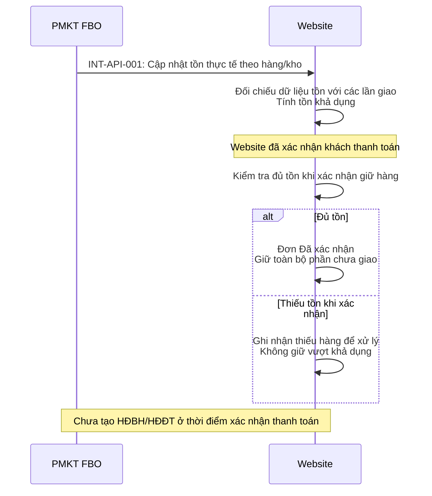
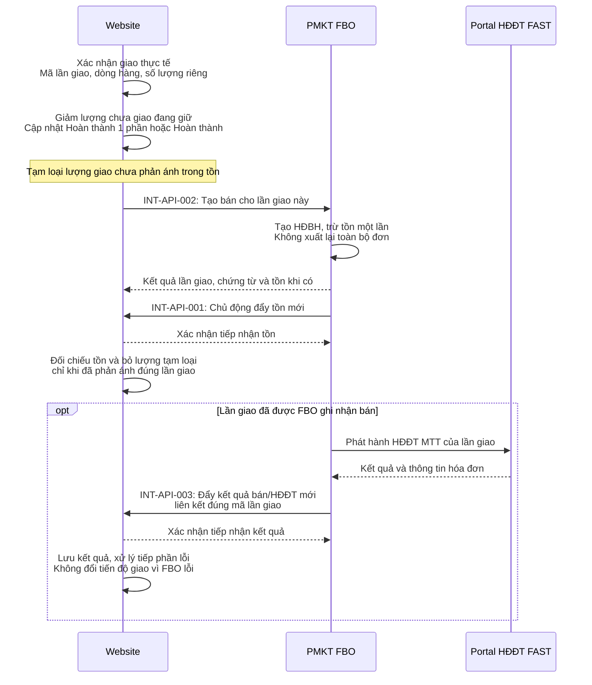
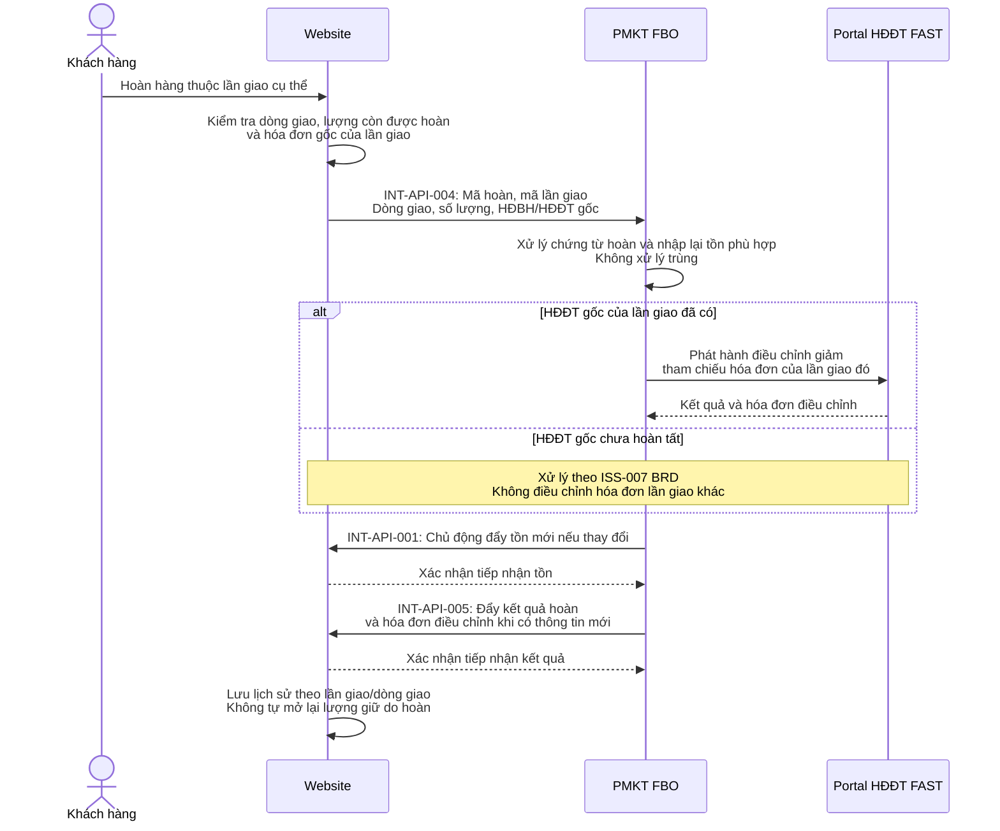

# Yêu cầu, giải pháp và API cơ bản - Website Phương Thảo / FBO

Ngày cập nhật: 08/10/2026. Cơ sở: BRD PT-BRD-001 phiên bản 1.2, cập nhật theo yêu cầu giao hàng nhiều lần và FBO chủ động đẩy dữ liệu mới.

URL và trường JSON là đề xuất để thống nhất với đội Website/FAST; địa chỉ môi trường, trường bắt buộc, HTTP status và mã lỗi chốt trong SRS. Bản này thay thế mô hình xuất hóa đơn ngay khi thanh toán của bản ngày 06/10/2026 và là cơ sở cho PDF cập nhật ngày 08/10/2026.

## 1. Yêu cầu

| Yêu cầu | Tham chiếu BRD |
|---|---|
| Nhận tồn thực tế từ FBO, tính/hiển thị tồn khả dụng | INV-BR-001, INV-BR-002 |
| Đã xác nhận: khách đã thanh toán, chưa giao hàng. Hoàn thành 1 phần: đã giao một phần. Hoàn thành: đã giao toàn bộ | ORD-BR-007, ORD-BR-008 |
| Chỉ giữ phần chưa giao của đơn Đã xác nhận và Hoàn thành 1 phần; không giữ trước xác nhận hoặc giữ lại phần đã giao | INV-BRU-002 |
| Mỗi lần giao gọi FBO tạo HĐBH, trừ tồn và xuất HĐĐT MTT cho riêng lượng/giá trị lần giao | ORD-BR-003, INVH-BR-001 |
| Hoàn hàng chỉ rõ lần giao/dòng giao để xử lý tồn, chứng từ và HĐĐT điều chỉnh đúng hóa đơn gốc | ORD-BR-005, INVH-BR-002 |
| Chống giao vượt số lượng cần giao, hoàn vượt số lượng lần giao và xử lý trùng khi gửi lại | ORD-BR-008, ORD-BRU-004, INT-BR-001 |

Xác nhận thanh toán do Website đã có xử lý. Cơ chế thanh toán và thực hiện hoàn tiền không thuộc phạm vi tích hợp.

## 2. Giải pháp

### 2.1. Mô hình đơn, lần giao và lần hoàn

**Một đơn → nhiều lần giao → mỗi lần giao một HĐBH và HĐĐT MTT → mỗi lần hoàn tham chiếu một lần giao và hóa đơn gốc tương ứng.**

| Đối tượng | Mã và thông tin liên kết |
|---|---|
| Đơn | `order_code`, dòng đơn `order_line_id`, số lượng xác nhận |
| Lần giao | `shipment_code`, ngày giao, `order_code`; dòng giao `shipment_line_id` trỏ về `order_line_id` |
| HĐBH/HĐĐT | Liên kết `order_code` và `shipment_code`; không dùng chỉ mã đơn để xác định hóa đơn |
| Lần hoàn | `return_code`, mã lần giao `shipment_code`, HĐBH/HĐĐT gốc; dòng hoàn trỏ `shipment_line_id` |

Ví dụ đơn D001 có 10 áo: G001 giao 4 → hóa đơn 1; G002 giao 6 → hóa đơn 2. Hoàn 2 áo thuộc G001 chỉ điều chỉnh hóa đơn 1. Nếu trả cả hàng G001 và G002, tách thành hai yêu cầu hoàn tương ứng.

Trạng thái đơn theo giao thực tế, kết quả đồng bộ FBO/HĐĐT theo từng lần giao. Hoàn hàng không xóa lịch sử đã giao hoặc tự mở lại lượng giữ/giao bù.

### 2.2. Tồn kho và giữ phần chưa giao

Website cung cấp API tồn; FBO chủ động gọi khi có tồn mới, kể cả biến động ngoài đơn Website. Website không cần gọi FBO để lấy tồn. Website giữ lượng chưa giao của đơn Đã xác nhận và Hoàn thành 1 phần.

**Lượng chưa giao = Lượng xác nhận - Lượng đã giao lũy kế - Lượng chưa giao đã hủy hợp lệ.**

Khi đã đối chiếu đầy đủ biến động giao, **Tồn khả dụng = Tồn thực tế - Tồn bị giữ**. Trong lúc đã giao nhưng dữ liệu tồn đang dùng chưa phản ánh lần giao, cần tạm loại lượng đó khỏi khả dụng:

**Tồn khả dụng = Tồn thực tế - Tồn bị giữ - Lượng đã giao chưa phản ánh trong tồn.**

Phần tạm loại là kiểm soát đồng bộ, không phải giữ hàng nghiệp vụ đã giao. Ví dụ tồn 100, đơn giữ 10: giao 4 nhưng FBO chưa phản ánh, còn giữ 6 và tạm loại 4 → khả dụng vẫn 90. Khi đối chiếu tồn 96 đã phản ánh lần giao, bỏ tạm loại 4 → 96 - 6 = 90.



Hủy hợp lệ phần chưa giao chỉ nhả lượng giữ của phần đó, không nhập lại tồn hoặc điều chỉnh hóa đơn đã giao. Không giữ Chờ thanh toán và không áp dụng thời hạn T của mô hình trước.

### 2.3. Giao hàng và tạo hóa đơn theo lần giao



Đơn có thể Đã xác nhận → Hoàn thành nếu giao hết một lần; giao thêm nhưng còn thiếu thì vẫn Hoàn thành 1 phần. Mỗi lần giao có kết quả đồng bộ riêng; lỗi HĐĐT không làm trừ tồn/tạo bán lại.

### 2.4. Hoàn đúng lần giao và hóa đơn gốc



## 3. Đặc tả API cơ bản

### 3.1. Quy ước

```http
Content-Type: application/json
Authorization: Bearer <token>
```

Website cấp token cho FBO khi gọi API Website; FBO cấp token cho Website khi gọi API FBO. URL đề xuất dùng `{WEBSITE_BASE_URL}` và `{FBO_BASE_URL}` thay bằng địa chỉ môi trường.

Response có `success`, `error_code`, `error_message`, `data`. `success: true` là kết quả tiếp nhận hợp lệ, không mặc định mọi nghiệp vụ đã thành công. Kết quả bán/tồn/HĐĐT được theo dõi riêng với các trạng thái `PENDING`, `SUCCESS`, `FAILED` và lỗi riêng nếu có.

FBO chủ động gọi INT-API-001 khi tồn thay đổi, INT-API-003 khi kết quả bán/HĐĐT của lần giao có thông tin mới và INT-API-005 khi kết quả hoàn/HĐĐT điều chỉnh có thông tin mới. Không dùng Website polling làm luồng chính. Website chỉ trả xác nhận sau khi lưu dữ liệu an toàn; nếu lỗi hoặc mất xác nhận, FBO lưu hàng đợi và gửi lại cùng sự kiện. Website chống xử lý trùng và không ghi đè dữ liệu mới bằng sự kiện cũ. Callback kết quả không ghi đè tồn thực tế; mọi cập nhật tồn đi qua INT-API-001 để đối chiếu nhất quán.

```json
{
  "success": false,
  "error_code": "INVALID_REQUEST",
  "error_message": "Du lieu gui len khong hop le",
  "data": null
}
```

Mã lỗi dự kiến: `UNAUTHORIZED`, `INVALID_REQUEST`, `WAREHOUSE_NOT_FOUND`, `PRODUCT_NOT_FOUND`, `REQUEST_NOT_FOUND`, `REQUEST_CONFLICT`, `SHIPMENT_QUANTITY_EXCEEDED`, `RETURN_QUANTITY_EXCEEDED`, `INVOICE_SHIPMENT_MISMATCH`, `INTERNAL_ERROR`.

### 3.2. INT-API-001 - Cập nhật tồn thực tế

| Thuộc tính | Đặc tả |
|---|---|
| Hệ thống phụ trách | Website |
| Hệ thống gọi | FBO |
| Mục đích | FBO chủ động cập nhật tồn thực tế khi có thay đổi, nhiều mã hàng/mã kho một lần |
| URL đề xuất | `{WEBSITE_BASE_URL}/api/v1/integration/inventory/update` |
| Method | POST |
| Authen | Token do Website cấp, `Authorization: Bearer <token>` |
| Request | Danh sách mã kho, mã hàng, số lượng tồn thực tế |
| Response | Kết quả cập nhật, mã/mô tả lỗi nếu có |

**Request mẫu:**

```json
{
  "items": [
    { "warehouse_code": "ONLINE", "product_code": "AO-001", "quantity": 100 },
    { "warehouse_code": "ONLINE", "product_code": "QUAN-001", "quantity": 50 },
    { "warehouse_code": "KHO-02", "product_code": "AO-001", "quantity": 20 }
  ]
}
```

**Response mẫu:**

```json
{
  "success": true,
  "error_code": null,
  "error_message": null,
  "data": { "updated_count": 3 }
}
```

Số lượng là tồn mới thay thế số tồn đang lưu, không phải lượng cộng/trừ; hàng/kho không gửi giữ nguyên. Đề xuất batch có một dòng sai thì từ chối cả batch. FBO chủ động đẩy khi tồn thay đổi, gồm bán, nhập/hoàn và biến động kho ngoài Website. SRS bổ sung mã sự kiện, mốc/phiên bản dữ liệu, retry và cách nhận diện các lần giao đã phản ánh theo ISS-004; payload cơ bản này chưa đủ để giải quyết đối chiếu tồn khi nhận phản hồi khác thứ tự.

### 3.3. INT-API-002 - Ghi nhận bán theo lần giao

| Thuộc tính | Đặc tả |
|---|---|
| Hệ thống phụ trách | FBO |
| Hệ thống gọi | Website |
| Mục đích | Tạo HĐBH, trừ tồn và khởi tạo HĐĐT MTT cho từng lần giao |
| URL đề xuất | `{FBO_BASE_URL}/api/v1/integration/shipments/sales` |
| Method | POST |
| Authen | Token do FBO cấp, `Authorization: Bearer <token>` |
| Request | Mã yêu cầu, mã đơn, mã/ngày lần giao, bộ phận/kho, người mua, các dòng giao và giá trị lần giao |
| Response | Kết quả riêng của lần giao, HĐBH, tồn sau xử lý, trạng thái HĐĐT/thông tin hóa đơn nếu có |

**Request mẫu: đơn 10 áo, lần G001 giao 4 áo:**

```json
{
  "request_id": "SALE-G001",
  "order_code": "D001",
  "shipment_code": "G001",
  "shipment_date": "2026-10-08",
  "department_code": "ONLINE",
  "warehouse_code": "ONLINE",
  "buyer": {
    "name": "Nguyen Van A",
    "phone": "0900000000",
    "address": "Ha Noi",
    "tax_code": null,
    "identity_number": null
  },
  "items": [
    {
      "shipment_line_id": "G001-1",
      "order_line_id": "D001-1",
      "product_code": "AO-001",
      "unit": "CAI",
      "quantity": 4,
      "unit_price": 100000,
      "discount_amount": 0,
      "tax_amount": 0,
      "amount": 400000
    }
  ],
  "shipment_amount": 400000
}
```

**Response mẫu:**

```json
{
  "success": true,
  "error_code": null,
  "error_message": null,
  "data": {
    "request_id": "SALE-G001",
    "order_code": "D001",
    "shipment_code": "G001",
    "sales_status": "SUCCESS",
    "inventory_status": "SUCCESS",
    "sales_document_code": "HDBH-G001",
    "inventory": [
      { "warehouse_code": "ONLINE", "product_code": "AO-001", "quantity": 96 }
    ],
    "invoice_status": "PENDING",
    "invoice": null
  }
}
```

Chỉ gửi lượng giao lần này, không gửi 10 áo của toàn đơn. Lần G002 có `shipment_code`/`request_id` riêng và 6 áo. Gửi lại G001 giữ nguyên mã và nội dung; cùng mã nhưng khác nội dung trả `REQUEST_CONFLICT`. `amount`/`shipment_amount` là giá trị của lần giao sau chiết khấu, gồm thuế; phân bổ chiết khấu/thuế chốt trong SRS.

### 3.4. INT-API-003 - FBO đẩy kết quả bán/HĐĐT theo lần giao

| Thuộc tính | Đặc tả |
|---|---|
| Hệ thống phụ trách | Website |
| Hệ thống gọi | FBO |
| Mục đích | FBO chủ động thông báo kết quả HĐBH/HĐĐT mới của đúng lần giao |
| URL đề xuất | `{WEBSITE_BASE_URL}/api/v1/integration/shipments/sales/result` |
| Method | POST |
| Authen | Token do Website cấp, `Authorization: Bearer <token>` |
| Request | Mã sự kiện/phiên bản, mã đơn/lần giao/yêu cầu bán, kết quả HĐBH/tồn/HĐĐT và thông tin hóa đơn |
| Response | Xác nhận Website đã tiếp nhận, mã/mô tả lỗi nếu có |

**Request mẫu:**

```json
{
  "event_id": "SALE-G001-E002",
  "event_version": 2,
  "data": {
    "order_code": "D001",
    "shipment_code": "G001",
    "request_id": "SALE-G001",
    "sales_status": "SUCCESS",
    "inventory_status": "SUCCESS",
    "sales_document_code": "HDBH-G001",
    "invoice_status": "SUCCESS",
    "invoice": {
      "invoice_id": "HDDT-G001",
      "invoice_number": "0000001",
      "series": "<ky_hieu>",
      "template": "<mau_so>",
      "lookup_url": "<link_tra_cuu>",
      "lookup_code": "<ma_tra_cuu>"
    }
  }
}
```

**Response mẫu:**

```json
{
  "success": true,
  "error_code": null,
  "error_message": null,
  "data": { "event_id": "SALE-G001-E002", "received": true }
}
```

`event_version` tăng theo lần giao; retry giữ nguyên mã/nội dung. Website xác nhận sự kiện trùng đã lưu, bỏ qua phiên bản cũ. Tồn mới gửi riêng qua INT-API-001.

### 3.5. INT-API-004 - Hoàn hàng chỉ định lần giao

| Thuộc tính | Đặc tả |
|---|---|
| Hệ thống phụ trách | FBO |
| Hệ thống gọi | Website |
| Mục đích | Xử lý hoàn của một lần giao, nhập lại tồn phù hợp và điều chỉnh đúng HĐĐT gốc |
| URL đề xuất | `{FBO_BASE_URL}/api/v1/integration/returns` |
| Method | POST |
| Authen | Token do FBO cấp, `Authorization: Bearer <token>` |
| Request | Mã yêu cầu/mã hoàn, mã đơn/lần giao, HĐBH/HĐĐT gốc nếu đã có, ngày/lý do, dòng giao và lượng/giá trị hoàn |
| Response | Kết quả chứng từ, lượng/giá trị hoàn, lượng nhập lại kho bán, tồn mới và hóa đơn điều chỉnh tương ứng |

**Request mẫu: hoàn 2 áo thuộc G001, không phải G002:**

```json
{
  "request_id": "RETURN-R001",
  "return_code": "R001",
  "order_code": "D001",
  "shipment_code": "G001",
  "sales_document_code": "HDBH-G001",
  "original_invoice_id": "HDDT-G001",
  "return_date": "2026-10-08",
  "reason": "Hoan 2 ao thuoc lan giao G001",
  "items": [
    {
      "shipment_line_id": "G001-1",
      "product_code": "AO-001",
      "quantity": 2,
      "discount_amount": 0,
      "tax_amount": 0,
      "amount": 200000
    }
  ]
}
```

**Response mẫu sau khi cả G001/G002 đã bán, tồn 90 và hoàn nhập lại 2:**

```json
{
  "success": true,
  "error_code": null,
  "error_message": null,
  "data": {
    "return_code": "R001",
    "order_code": "D001",
    "shipment_code": "G001",
    "return_status": "SUCCESS",
    "inventory_status": "SUCCESS",
    "return_document_code": "TRA-R001",
    "processed_amount": 200000,
    "items": [
      { "shipment_line_id": "G001-1", "returned_quantity": 2, "restocked_quantity": 2 }
    ],
    "inventory": [
      { "warehouse_code": "ONLINE", "product_code": "AO-001", "quantity": 92 }
    ],
    "adjustment_invoice_status": "PENDING",
    "adjustment_invoice": null
  }
}
```

FBO phải kiểm tra lần giao thuộc đơn, dòng thuộc lần giao và hóa đơn gốc thuộc chính lần giao đó. G001 chỉ giao 4, tổng hoàn thành công/đang xử lý không được vượt 4 dù D001 có 10. `restocked_quantity` có thể 0 nếu hàng không đủ điều kiện bán. Hoàn nhiều lần giao phải tách request; gửi lại cùng lần hoàn giữ nguyên mã/nội dung. Hủy phần chưa giao không gọi API trả hàng này.

### 3.6. INT-API-005 - FBO đẩy kết quả hoàn/HĐĐT điều chỉnh

| Thuộc tính | Đặc tả |
|---|---|
| Hệ thống phụ trách | Website |
| Hệ thống gọi | FBO |
| Mục đích | FBO chủ động gửi kết quả hoàn và hóa đơn điều chỉnh khi có thông tin mới |
| URL đề xuất | `{WEBSITE_BASE_URL}/api/v1/integration/returns/result` |
| Method | POST |
| Authen | Token do Website cấp, `Authorization: Bearer <token>` |
| Request | Mã sự kiện/phiên bản, mã yêu cầu/hoàn/đơn/lần giao, trạng thái từng nghiệp vụ, chứng từ, lượng/giá trị và hóa đơn điều chỉnh |
| Response | Xác nhận Website đã tiếp nhận, mã/mô tả lỗi nếu có |

**Request mẫu:**

```json
{
  "event_id": "RETURN-R001-E002",
  "event_version": 2,
  "data": {
    "request_id": "RETURN-R001",
    "return_code": "R001",
    "order_code": "D001",
    "shipment_code": "G001",
    "return_status": "SUCCESS",
    "inventory_status": "SUCCESS",
    "return_document_code": "TRA-R001",
    "processed_amount": 200000,
    "items": [
      { "shipment_line_id": "G001-1", "returned_quantity": 2, "restocked_quantity": 2 }
    ],
    "adjustment_invoice_status": "SUCCESS",
    "adjustment_invoice": {
      "invoice_id": "HDDT-DC-R001",
      "original_invoice_id": "HDDT-G001",
      "invoice_number": "0000003",
      "series": "<ky_hieu>",
      "template": "<mau_so>",
      "lookup_url": "<link_tra_cuu>",
      "lookup_code": "<ma_tra_cuu>"
    }
  }
}
```

**Response mẫu:**

```json
{
  "success": true,
  "error_code": null,
  "error_message": null,
  "data": { "event_id": "RETURN-R001-E002", "received": true }
}
```

FBO gửi khi trạng thái hoàn hoặc hóa đơn điều chỉnh có thông tin mới. `event_version` tăng theo lần hoàn; retry giữ mã sự kiện/nội dung, Website chống trùng và bỏ qua phiên bản cũ như INT-API-003. Tồn mới gửi riêng qua INT-API-001; không tự cộng tồn từ thông báo hoàn.

### 3.7. Nội dung cần đặc tả trong SRS

- API lấy đúng lần giao/dòng giao; các bộ HĐBH/HĐĐT phải lưu quan hệ một-một với lần giao trong mô hình đề xuất.
- Cơ chế mốc tồn và đối chiếu lượng đã giao chưa phản ánh theo ISS-004.
- Mốc xác nhận giao thực tế, sửa sai/hủy lần giao và xử lý thiếu tồn khi đã nhận tiền theo ISS-008.
- Trình tự hoàn khi lần giao hoặc hóa đơn gốc chưa hoàn tất theo ISS-007.
- Phân bổ chiết khấu/thuế, giá trị giao/hoàn; không xuất lại cả đơn khi giao từng phần.
- URL môi trường, trường bắt buộc, giới hạn batch, mã lỗi, HTTP status, thông tin lỗi riêng cho từng nghiệp vụ.
- Hàng đợi FBO, thời gian/lần retry, theo dõi sự kiện chưa được Website xác nhận, phiên bản và chống trùng/đảo thứ tự theo INT-BR-003. Đối soát thủ công khi hết retry, không phụ thuộc Website chủ động lấy thông tin mới.

API đã có mã giữ nguyên để truy vết. INT-API-003/005 thay thế đặc tả tra cứu trước đây bằng API Website nhận thông báo chủ động từ FBO; chiều gọi, URL, request/response đổi theo phiên bản 1.2. INT-API-002/004 vẫn do Website gọi FBO để yêu cầu bán/hoàn; tồn kho chủ động cập nhật qua INT-API-001.
