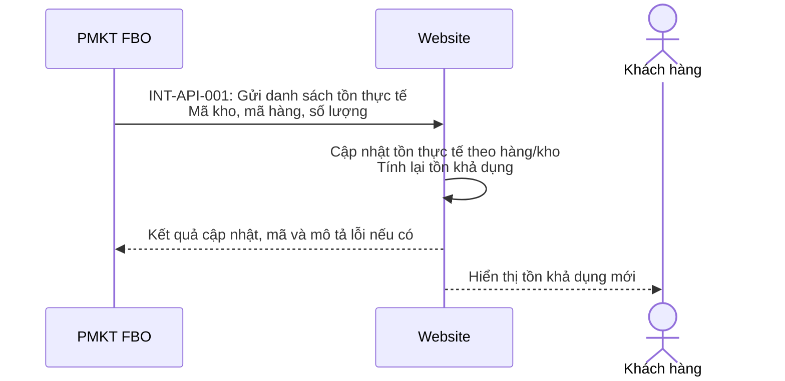
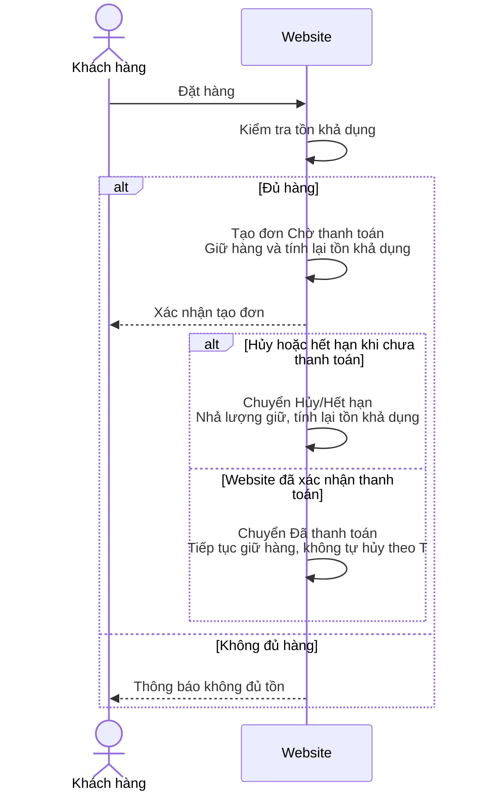
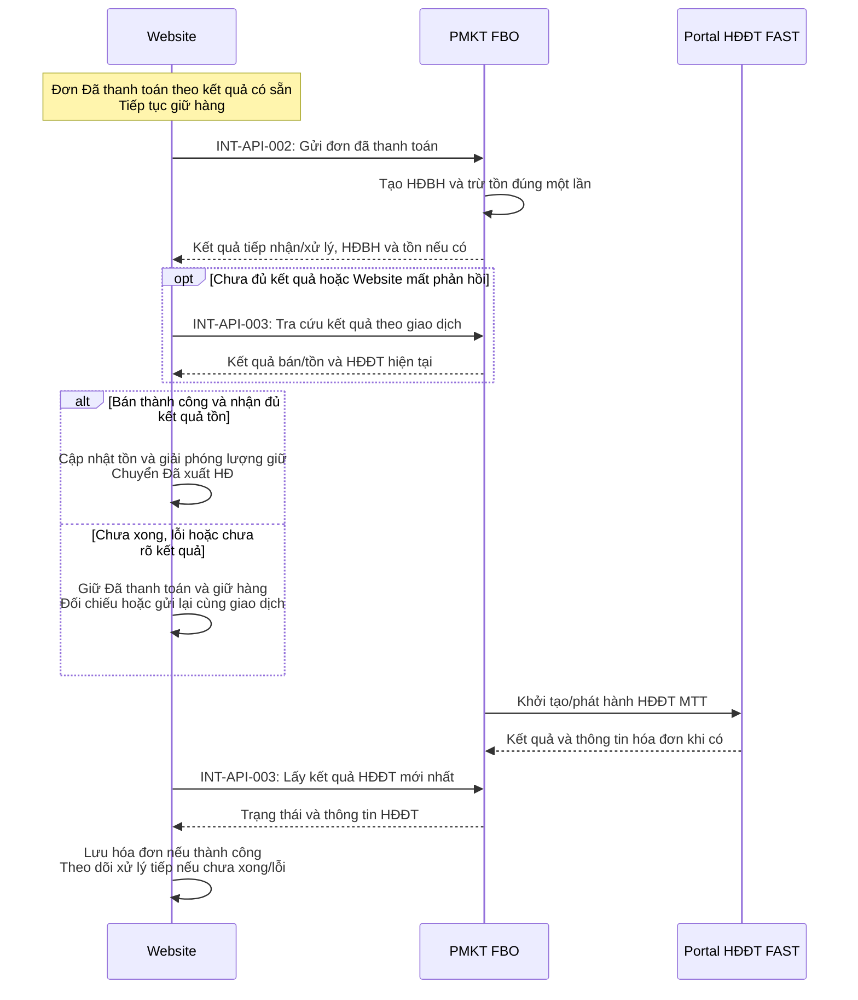
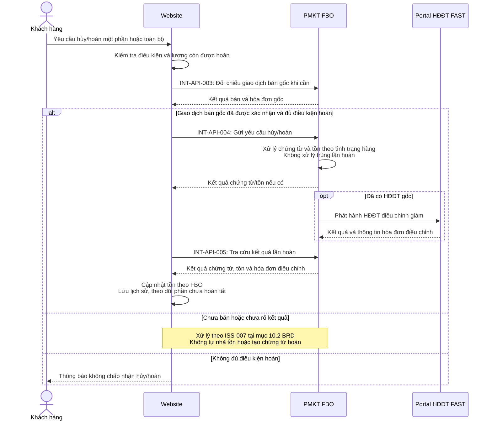

# Yêu cầu, giải pháp và đặc tả API cơ bản - Website Phương Thảo / FBO

Ngày cập nhật: 06/10/2026. Cơ sở: BRD PT-BRD-001, phiên bản 1.0 đã chốt trong trao đổi dự án.

URL, tên trường JSON và mã lỗi dưới đây là đề xuất để hai đội thống nhất triển khai, chưa xác nhận là API hiện có của FAST. `{WEBSITE_BASE_URL}` và `{FBO_BASE_URL}` được thay bằng địa chỉ môi trường triển khai.

## 1. Yêu cầu

| Mã BRD | Yêu cầu |
|---|---|
| INV-BR-001, INV-BR-002 | Website nhận tồn thực tế từ FBO, tính và hiển thị số lượng hàng khách còn được đặt |
| ORD-BR-001 | Khách tự đặt đơn trên Website; không đặt vượt tồn khả dụng, kể cả nhiều khách đặt đồng thời |
| ORD-BR-002, ORD-BR-004 | Giữ hàng khi Chờ thanh toán; tự hủy khi quá hạn chưa thanh toán hoặc khi khách hủy và nhả lượng giữ |
| ORD-BR-003, ORD-BR-007 | Gửi đơn được Website xác nhận đã thanh toán sang FBO để ghi nhận bán; phân biệt đơn đã trả tiền với đơn FBO đã xử lý xong |
| INVH-BR-001 | FBO khởi tạo/phát hành HĐĐT MTT qua Portal và cung cấp thông tin hóa đơn cho Website |
| ORD-BR-005, ORD-BR-006, INV-BR-003, INVH-BR-002 | Hủy/hoàn sau thanh toán, một phần hoặc toàn bộ; xử lý chứng từ, tồn, HĐĐT điều chỉnh giảm và giữ lịch sử |
| INT-BR-001, INT-BR-002 | Theo dõi kết quả, đối chiếu/gửi lại khi lỗi mà không tạo chứng từ, hóa đơn hoặc thay đổi tồn trùng |

Website đã có chức năng xác nhận thanh toán. Tích hợp sử dụng kết quả đó làm đầu vào; xây dựng cơ chế thanh toán và thực hiện hoàn tiền nằm ngoài phạm vi.

## 2. Giải pháp

### 2.1. Cập nhật tồn thực tế và tính tồn khả dụng

**Website cung cấp API nhận tồn; FBO gọi để cập nhật tồn thực tế.** Một lần gửi có thể gồm nhiều mã hàng thuộc nhiều kho. Website cập nhật số tồn của từng cặp mã kho/mã hàng, rồi tính lại tồn khả dụng.

**Tồn khả dụng = Tồn thực tế - Tồn bị giữ.** Tồn bị giữ gồm lượng hàng trên các đơn Chờ thanh toán và Đã thanh toán chưa hoàn tất cập nhật bán/tồn. Website quản lý lượng giữ; FBO quản lý tồn thực tế.



FBO gửi tồn ban đầu và cập nhật khi tồn thay đổi, bao gồm thay đổi ngoài luồng đơn Website. Tần suất, thứ tự cập nhật và đối chiếu lượng giữ với giao dịch bán được đặc tả trong SRS theo ISS-004 của BRD.

### 2.2. Đặt hàng, giữ hàng và hủy trước thanh toán

Website kiểm tra tồn, tạo đơn Chờ thanh toán và giữ hàng. Khi hủy hoặc quá T phút chưa thanh toán, Website nhả lượng giữ. Không gọi API giữ/nhả tồn tại FBO.



Giá trị T chốt trong SRS. Xác nhận thanh toán do chức năng Website có sẵn xử lý.

### 2.3. Đồng bộ đơn đã thanh toán và HĐĐT MTT

Website gửi đơn sang FBO. FBO tạo HĐBH, trừ tồn và phối hợp Portal xử lý HĐĐT. Website chỉ chuyển Đã xuất HĐ khi xác nhận bán thành công và cập nhật tồn, giải phóng lượng giữ tương ứng. Kết quả HĐĐT được theo dõi riêng.



FBO có thể xử lý HĐĐT cùng lúc ghi nhận bán. Lỗi hóa đơn không làm Website ghi nhận bán lại, giữ lại lượng hàng đã bán hoặc quay về Chờ thanh toán. Đã xuất HĐ xác nhận HĐBH/tồn, không mặc định HĐĐT đã phát hành.

### 2.4. Hủy/hoàn sau khi đã ghi nhận bán

Website kiểm tra điều kiện và gửi số lượng/giá trị hủy/hoàn. FBO xử lý chứng từ và tồn theo tình trạng hàng; chỉ hàng quay lại kho bán được mới tăng tồn bán online. Khi có HĐĐT gốc, FBO/Portal xử lý HĐĐT điều chỉnh giảm.



Hoàn một phần/toàn bộ dùng cùng cơ chế, khác số lượng. Với giao dịch bán hoặc HĐĐT gốc chưa hoàn tất, áp dụng ISS-007 trong BRD, không mặc định có thể lập hóa đơn điều chỉnh ngay.

## 3. Đặc tả API cơ bản

### 3.1. Quy ước chung

Tất cả API dùng JSON và token trong header:

```http
Content-Type: application/json
Authorization: Bearer <token>
```

Website cấp token cho FBO khi gọi API Website; FBO cấp token cho Website khi gọi API FBO. Không truyền token trong body/URL.

Response chung: `success` (thành công hay không), `error_code`, `error_message` và `data` nếu có. Với API gửi giao dịch, `success: true` xác nhận tiếp nhận hợp lệ; trạng thái trong `data` mới xác nhận nghiệp vụ đã hoàn tất.

**Response lỗi chung mẫu:**

```json
{
  "success": false,
  "error_code": "INVALID_REQUEST",
  "error_message": "Du lieu gui len khong hop le",
  "data": null
}
```

Mã lỗi dự kiến: `UNAUTHORIZED`, `INVALID_REQUEST`, `WAREHOUSE_NOT_FOUND`, `PRODUCT_NOT_FOUND`, `REQUEST_NOT_FOUND`, `REQUEST_CONFLICT` (cùng mã yêu cầu nhưng khác nội dung), `INTERNAL_ERROR`. Danh mục và HTTP status chốt trong SRS. Thông báo JSON mẫu dùng chữ không dấu.

### 3.2. INT-API-001 - Cập nhật tồn thực tế

| Thuộc tính | Đặc tả |
|---|---|
| Hệ thống phụ trách | Website |
| Hệ thống gọi | FBO |
| Mục đích | Cập nhật tồn kho thực tế từ FBO cho Website |
| URL đề xuất | `{WEBSITE_BASE_URL}/api/v1/integration/inventory/update` |
| Method | POST |
| Authen | Token do Website cấp, `Authorization: Bearer <token>` |
| Request | JSON gồm danh sách `items`, mỗi phần tử có `warehouse_code` (mã kho), `product_code` (mã hàng), `quantity` (số lượng tồn thực tế). Hỗ trợ nhiều mã hàng/mã kho một lần |
| Response | JSON thông báo thành công hay không, mã và mô tả lỗi nếu có |

**Request mẫu:**

```json
{
  "items": [
    { "warehouse_code": "ONLINE", "product_code": "AO-001", "quantity": 100 },
    { "warehouse_code": "ONLINE", "product_code": "QUAN-001", "quantity": 50 },
    { "warehouse_code": "KHO-02", "product_code": "AO-001", "quantity": 20 }
  ]
}
```

**Response thành công:**

```json
{
  "success": true,
  "error_code": null,
  "error_message": null,
  "data": { "updated_count": 3 }
}
```

**Response lỗi ví dụ:**

```json
{
  "success": false,
  "error_code": "PRODUCT_NOT_FOUND",
  "error_message": "Ma hang AO-999 khong ton tai tren Website",
  "data": null
}
```

`quantity` là số tồn mới thay thế số tồn thực tế đang lưu, không phải lượng cộng/trừ. Hàng/kho không có trong request giữ nguyên. Đề xuất kiểm tra cả danh sách trước khi cập nhật: một dòng sai thì từ chối cả batch, không cập nhật một phần. Mốc dữ liệu/phiên bản và đối chiếu giao dịch theo ISS-004 cần được bổ sung trong SRS để tránh cập nhật sai thứ tự hoặc tính giảm tồn hai lần.

### 3.3. INT-API-002 - Tiếp nhận đơn đã thanh toán

| Thuộc tính | Đặc tả |
|---|---|
| Hệ thống phụ trách | FBO |
| Hệ thống gọi | Website |
| Mục đích | Tiếp nhận đơn Website đã xác nhận thanh toán, tạo HĐBH, trừ tồn và khởi tạo xử lý HĐĐT MTT |
| URL đề xuất | `{FBO_BASE_URL}/api/v1/integration/sales` |
| Method | POST |
| Authen | Token do FBO cấp |
| Request | Mã yêu cầu, mã/ngày đơn, mã bộ phận/kho, người mua và thông tin xuất hóa đơn, danh sách dòng hàng và giá trị đơn |
| Response | Kết quả tiếp nhận, trạng thái bán/tồn/HĐĐT riêng, HĐBH, tồn sau bán và thông tin hóa đơn nếu có |

**Request mẫu:**

```json
{
  "request_id": "SALE-WEB-0001",
  "order_code": "WEB-0001",
  "order_date": "2026-10-06",
  "department_code": "ONLINE",
  "warehouse_code": "ONLINE",
  "buyer": {
    "name": "Nguyen Van A",
    "phone": "0900000000",
    "address": "Ha Noi",
    "tax_code": null,
    "identity_number": null
  },
  "items": [
    {
      "line_id": "1",
      "product_code": "AO-001",
      "unit": "CAI",
      "quantity": 3,
      "unit_price": 100000,
      "discount_amount": 0,
      "tax_amount": 0,
      "amount": 300000
    }
  ],
  "total_amount": 300000
}
```

**Response mẫu: bán hoàn tất, HĐĐT còn chờ:**

```json
{
  "success": true,
  "error_code": null,
  "error_message": null,
  "data": {
    "request_id": "SALE-WEB-0001",
    "order_code": "WEB-0001",
    "sales_status": "SUCCESS",
    "inventory_status": "SUCCESS",
    "sales_document_code": "HDBH-0001",
    "inventory": [
      { "warehouse_code": "ONLINE", "product_code": "AO-001", "quantity": 97 }
    ],
    "invoice_status": "PENDING",
    "invoice": null
  }
}
```

Nếu mới tiếp nhận, trạng thái bán/tồn là `PENDING`, thông tin chưa có là `null` hoặc danh sách rỗng. Website giữ Đã thanh toán và giữ hàng đến khi đủ kết quả bán/tồn. Gửi lại cùng giao dịch giữ nguyên `request_id` và nội dung. `amount`/`total_amount` trong ví dụ là giá trị sau chiết khấu, gồm thuế; quy tắc tính và ánh xạ mã khách/nhân viên mặc định chốt trong SRS.

### 3.4. INT-API-003 - Tra cứu kết quả bán và HĐĐT

| Thuộc tính | Đặc tả |
|---|---|
| Hệ thống phụ trách | FBO |
| Hệ thống gọi | Website |
| Mục đích | Đối chiếu bán/tồn khi mất phản hồi, theo dõi xử lý và lấy thông tin HĐĐT sau phát hành |
| URL đề xuất | `{FBO_BASE_URL}/api/v1/integration/sales/status` |
| Method | POST |
| Authen | Token do FBO cấp |
| Request | `request_id` của giao dịch bán và `order_code` để đối chiếu |
| Response | Kết quả tra cứu, trạng thái từng nghiệp vụ, thông tin HĐBH, kết quả tồn và HĐĐT nếu có |

**Request mẫu:**

```json
{ "request_id": "SALE-WEB-0001", "order_code": "WEB-0001" }
```

**Response mẫu:**

```json
{
  "success": true,
  "error_code": null,
  "error_message": null,
  "data": {
    "request_id": "SALE-WEB-0001",
    "order_code": "WEB-0001",
    "sales_status": "SUCCESS",
    "inventory_status": "SUCCESS",
    "sales_document_code": "HDBH-0001",
    "invoice_status": "SUCCESS",
    "invoice": {
      "invoice_id": "HDDT-0001",
      "invoice_number": "0000001",
      "series": "<ky_hieu>",
      "template": "<mau_so>",
      "lookup_url": "<link_tra_cuu>",
      "lookup_code": "<ma_tra_cuu>"
    }
  }
}
```

Tồn sau bán có thể trả bổ sung theo cấu trúc `inventory` của INT-API-002. Không dùng tồn lịch sử để ghi đè tồn mới hơn. Từng nghiệp vụ có trạng thái `PENDING`, `SUCCESS` hoặc `FAILED`, kèm mã/mô tả lỗi riêng khi thất bại. Tra cứu không tìm thấy trả `REQUEST_NOT_FOUND`; lỗi tra cứu không chứng minh giao dịch chưa được ghi nhận.

### 3.5. INT-API-004 - Tiếp nhận hủy/hoàn sau ghi nhận bán

| Thuộc tính | Đặc tả |
|---|---|
| Hệ thống phụ trách | FBO |
| Hệ thống gọi | Website |
| Mục đích | Xử lý chứng từ hủy/hoàn, tồn và HĐĐT điều chỉnh giảm cho giao dịch bán đã được xác nhận |
| URL đề xuất | `{FBO_BASE_URL}/api/v1/integration/returns` |
| Method | POST |
| Authen | Token do FBO cấp |
| Request | Mã yêu cầu hoàn, đơn/HĐBH/HĐĐT gốc nếu có, ngày/lý do, loại hủy/hoàn, dòng hàng và số lượng/giá trị điều chỉnh |
| Response | Kết quả tiếp nhận, trạng thái chứng từ/tồn/HĐĐT điều chỉnh riêng, lượng và giá trị xử lý, tồn mới và hóa đơn nếu có |

**Request mẫu:**

```json
{
  "request_id": "RETURN-WEB-0001-01",
  "order_code": "WEB-0001",
  "sales_document_code": "HDBH-0001",
  "original_invoice_id": "HDDT-0001",
  "return_date": "2026-10-06",
  "type": "RETURN",
  "reason": "Khach tra lai 1 san pham",
  "items": [
    {
      "original_line_id": "1",
      "product_code": "AO-001",
      "quantity": 1,
      "discount_amount": 0,
      "tax_amount": 0,
      "amount": 100000
    }
  ]
}
```

**Response mẫu: chứng từ/tồn hoàn tất, hóa đơn còn chờ:**

```json
{
  "success": true,
  "error_code": null,
  "error_message": null,
  "data": {
    "request_id": "RETURN-WEB-0001-01",
    "order_code": "WEB-0001",
    "return_status": "SUCCESS",
    "inventory_status": "SUCCESS",
    "return_document_code": "TRA-0001",
    "processed_amount": 100000,
    "items": [
      { "original_line_id": "1", "returned_quantity": 1, "restocked_quantity": 1 }
    ],
    "inventory": [
      { "warehouse_code": "ONLINE", "product_code": "AO-001", "quantity": 98 }
    ],
    "adjustment_invoice_status": "PENDING",
    "adjustment_invoice": null
  }
}
```

`type` nhận `CANCEL` hoặc `RETURN`. Một phần/toàn bộ dùng cùng API theo số lượng. `restocked_quantity` do FBO xác nhận theo tình trạng hàng, có thể bằng 0 dù có hàng hoàn. Tổng lượng hoàn không vượt lượng đã bán. Cùng lần hoàn dùng nguyên `request_id`; lần mới dùng mã mới. Khi bán chưa rõ kết quả, đối chiếu theo ISS-007 trước, không mặc định nhập lại hàng.

### 3.6. INT-API-005 - Tra cứu kết quả hủy/hoàn

| Thuộc tính | Đặc tả |
|---|---|
| Hệ thống phụ trách | FBO |
| Hệ thống gọi | Website |
| Mục đích | Lấy kết quả hủy/hoàn và HĐĐT điều chỉnh, đối chiếu sau mất phản hồi mà không xử lý hoàn/nhập kho lần nữa |
| URL đề xuất | `{FBO_BASE_URL}/api/v1/integration/returns/status` |
| Method | POST |
| Authen | Token do FBO cấp |
| Request | `request_id` của lần hoàn và `order_code` để đối chiếu |
| Response | Trạng thái từng nghiệp vụ, chứng từ, số lượng/giá trị xử lý và thông tin hóa đơn điều chỉnh nếu có |

**Request mẫu:**

```json
{ "request_id": "RETURN-WEB-0001-01", "order_code": "WEB-0001" }
```

**Response mẫu:**

```json
{
  "success": true,
  "error_code": null,
  "error_message": null,
  "data": {
    "request_id": "RETURN-WEB-0001-01",
    "order_code": "WEB-0001",
    "return_status": "SUCCESS",
    "inventory_status": "SUCCESS",
    "return_document_code": "TRA-0001",
    "processed_amount": 100000,
    "items": [
      { "original_line_id": "1", "returned_quantity": 1, "restocked_quantity": 1 }
    ],
    "adjustment_invoice_status": "SUCCESS",
    "adjustment_invoice": {
      "invoice_id": "HDDT-DC-0001",
      "original_invoice_id": "HDDT-0001",
      "invoice_number": "0000002",
      "series": "<ky_hieu>",
      "template": "<mau_so>",
      "lookup_url": "<link_tra_cuu>",
      "lookup_code": "<ma_tra_cuu>"
    }
  }
}
```

Tồn có thể trả bổ sung theo cấu trúc INT-API-004, có kiểm soát mốc dữ liệu. Phần chưa hoàn tất/thất bại trả trạng thái và lỗi riêng, không mặc định mọi bước thành công chỉ vì tra cứu trả `success: true`.

### 3.7. Nội dung chốt tiếp trong SRS

- URL thực tế, ánh xạ mã hàng/kho/đơn vị tính, trường bắt buộc, giới hạn batch, HTTP status và lỗi từng nghiệp vụ.
- Mốc dữ liệu và đối chiếu tồn với kết quả bán theo ISS-004, kể cả FBO gửi tồn trước phản hồi đơn.
- Cách dừng giao dịch bán chưa ghi nhận theo ISS-007. Chưa xác nhận FBO có API này, không tự nhả lượng giữ khi giao dịch bán còn có thể tiếp tục xử lý.
- Cách FBO/Portal đối chiếu, xử lý tiếp HĐĐT lỗi; chưa mặc định Website gọi API Portal trực tiếp.
